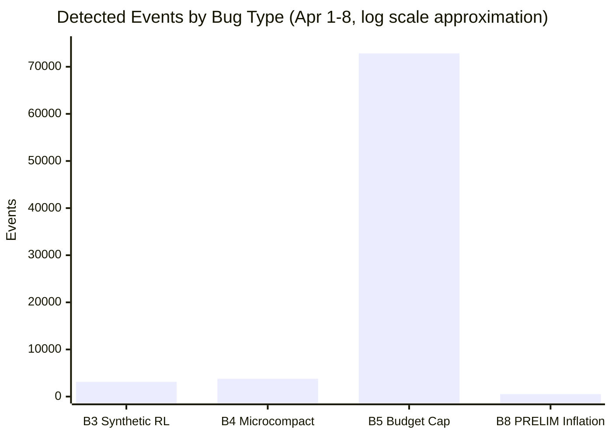

> **🇰🇷 [한국어 버전](ko/01_BUGS.md)**

# Bug Details — Technical Root Cause Analysis

> Bugs 1-2 (cache layer) are **fixed** in v2.1.91. Bugs 3-5 and 8 remain **unfixed** as of v2.1.91. Bugs 8a, 9, 10, 11, 2a added April 9.
>
> Bugs 1-2 were identified through community reverse engineering ([Reddit](https://www.reddit.com/r/ClaudeAI/s/AY2GHQa5Z6)). Bugs 3-5 and 8 were discovered through proxy-based testing on April 2-3. Bugs 8a-11 and 2a were identified through community-wide issue/comment analysis and fact-checking on April 6-9, 2026.

---

## Bug 1 — Sentinel Replacement (standalone binary only)

**GitHub Issue:** [anthropics/claude-code#40524](https://github.com/anthropics/claude-code/issues/40524)

The standalone binary's embedded Bun fork contains a `cch=00000` sentinel replacement mechanism. Under certain conditions, the sentinel in `messages` gets incorrectly substituted — breaking the cache prefix and forcing a full rebuild.

- **v2.1.89:** Catastrophic — cache read drops to 4-17%, never recovers
- **v2.1.90:** Partially mitigated — cold start still affected (47-67%), but recovers to 94-99% after warming
- **npm:** Not affected — the JavaScript bundle does not contain this logic

**Official fix in v2.1.89-90 ([changelog](https://code.claude.com/docs/en/changelog)):**
- v2.1.89: *"Fixed prompt cache misses in long sessions caused by tool schema bytes changing mid-session"*
- v2.1.90: *"Improved performance: eliminated per-turn JSON.stringify of MCP tool schemas on cache-key lookup"*

---

## Bug 2 — Resume Cache Breakage (v2.1.69+)

**GitHub Issue:** [anthropics/claude-code#34629](https://github.com/anthropics/claude-code/issues/34629)

`deferred_tools_delta` (introduced in v2.1.69) causes the first message's structure on `--resume` to not match the server's cached version — resulting in a complete cache miss. On a 500K token conversation, a single resume forces a full-price input pass over the entire context — the equivalent of replaying the whole conversation from scratch.

**Official fix in v2.1.90 ([changelog](https://code.claude.com/docs/en/changelog)):**
> *"Fixed --resume causing a full prompt-cache miss on the first request for users with deferred tools, MCP servers, or custom agents (regression since v2.1.69)"*

**Note:** `--continue` has the same cache invalidation behavior ([#42338](https://github.com/anthropics/claude-code/issues/42338) confirmed). We recommend avoiding both `--resume` and `--continue` until fully verified — start fresh sessions instead.

---

## Bug 3 — Client-Side False Rate Limiter (all versions)

**GitHub Issue:** [anthropics/claude-code#40584](https://github.com/anthropics/claude-code/issues/40584)

The local rate limiter generates **synthetic "Rate limit reached" errors** without ever calling the Anthropic API. These errors are identifiable in session logs by:

```json
{
  "model": "<synthetic>",
  "usage": { "input_tokens": 0, "output_tokens": 0 }
}
```

Triggered by large transcripts and concurrent sub-agent spawns. [@rwp65](https://github.com/rwp65) observed it with a ~74MB transcript in [#40584](https://github.com/anthropics/claude-code/issues/40584). The rate limiter appears to multiply `context_size × concurrent_requests`, so multi-agent workflows get blocked even when each individual request is small.

- **Discovery:** [@rwp65](https://github.com/rwp65) in [#40584](https://github.com/anthropics/claude-code/issues/40584) (March 29, 2026)
- **Cross-referenced by:** [@marlvinvu](https://github.com/marlvinvu) across [#40438](https://github.com/anthropics/claude-code/issues/40438), [#39938](https://github.com/anthropics/claude-code/issues/39938), [#38239](https://github.com/anthropics/claude-code/issues/38239)
- **Status:** **Unfixed** — present in all versions through v2.1.91
- **Impact:** Users see "Rate limit reached" immediately, even after hours of inactivity when the budget should have fully reset. No API call is made, so the error is entirely client-generated.

---

## Bug 4 — Silent Microcompact → Context Quality Degradation (all versions, server-controlled)

**GitHub Issue:** [anthropics/claude-code#42542](https://github.com/anthropics/claude-code/issues/42542)

Three compaction mechanisms in `src/services/compact/` run **silently on every API call**, stripping old tool results without user notification.

| Mechanism | Source | Trigger | Control |
|-----------|--------|---------|---------|
| **Time-based microcompact** | `microCompact.ts:422` | Gap since last assistant message exceeds threshold | GrowthBook: `getTimeBasedMCConfig()` |
| **Cached microcompact** | `microCompact.ts:305` | Count-based trigger, uses `cache_edits` API to delete old tool results | GrowthBook: `getCachedMCConfig()` |
| **Session memory compact** | `sessionMemoryCompact.ts:57` | Runs before autocompact | GrowthBook flag |

**Key findings:**
- All three bypass `DISABLE_AUTO_COMPACT` and `CLAUDE_AUTOCOMPACT_PCT_OVERRIDE`
- Controlled by **server-side GrowthBook A/B testing flags** — Anthropic can change behavior without a client update
- Tool results silently replaced with `[Old tool result content cleared]` — no compaction notification shown
- **3,782 clearing events** (15,998 items cleared) detected via proxy (April 1-8 snapshot). Bug discovered April 2; proxy started April 1. Previously 327 (April 3 focused test only)
- All cleared indices are **even-numbered** → targets tool_use/tool_result pairs specifically
- Cleared indices **expand over time** as conversation grows

**Cache impact (updated April 3 — measured):**

Our proxy-based testing revealed a **correction** to the initial hypothesis: microcompact does NOT cause sustained cache invalidation in main sessions.

| Context | Cache ratio during clearing |
|---------|---------------------------|
| Main session | **99%+** — no impact (stable substitution preserves prefix) |
| Sub-agent cold start | **0-39%** — drops observed at clearing moments |
| Sub-agent warmed | **94-99%** — recovers normally |

Cache ratio stays high because the same `[Old tool result content cleared]` marker is substituted consistently, preserving the prompt prefix between calls. But the model can no longer see the original file contents or command outputs — it only sees the placeholder. In practice, this means the agent can't accurately quote earlier tool results and may retry approaches it already tried. [@Sn3th](https://github.com/Sn3th) reports effective context dropping to ~40-80K tokens in sessions with 50+ tool uses despite the 1M window — a 92-96% reduction in usable context.

- **Update (April 3):** GrowthBook flag survey across 4 machines / 4 accounts shows **all gates disabled** — yet context is still being stripped (a compaction code path independent of the three documented GrowthBook-gated mechanisms). See [05_MICROCOMPACT.md](05_MICROCOMPACT.md) for full analysis.
- **Discovery:** [@Sn3th](https://github.com/Sn3th) in [#42542](https://github.com/anthropics/claude-code/issues/42542) (April 2, 2026)
- **Status:** **Unfixed** in v2.1.91. 14 events detected in v2.1.91 test sessions, identical pattern.

---

## Bug 5 — Tool Result Budget Enforcement (all versions)

**Discovered:** April 3, 2026 (via cc-relay proxy enhancement)
**Source:** [@Sn3th](https://github.com/Sn3th) identified the GrowthBook flags; we confirmed behavioral activation.

A **separate pre-request pipeline** (`applyToolResultBudget()`) truncates tool results based on server-controlled thresholds. This runs BEFORE microcompact (Bug 4) and is independent of it.

**Active GrowthBook flags (confirmed in `~/.claude.json`):**
```
tengu_hawthorn_window:       200,000  (aggregate tool result cap across all messages)
tengu_pewter_kestrel:        {global: 50000, Bash: 30000, Grep: 20000, Snip: 1000}
tengu_summarize_tool_results: true    (system prompt tells model to expect clearing)
```

**Measured impact:**
- **72,839 budget events** across 20 sessions (April 1-8 snapshot). Previously 261 in a single session (April 3)
- **100% truncation rate** — every event results in content reduction
- **90.6% of events** truncate to 11-100 chars; 9.4% to 0-10 chars (average: 24 chars)
- Budget threshold exceeded at **242,094 chars** (> 200K cap)
- After ~15-20 file reads, older results are silently truncated

**v2.1.91:** Added `_meta["anthropic/maxResultSizeChars"]` (up to 500K) — but this only applies to **MCP tool results**. Built-in tools (Read, Bash, Grep, Glob, Edit) are **not affected** by this override. The 200K aggregate cap remains for normal usage.

**No env var override exists.** `DISABLE_AUTO_COMPACT`, `DISABLE_COMPACT`, and all other known environment variables do not touch this code path.

---

> **Note on numbering:** Bugs 6 and 7 were identified during the investigation (compaction infinite loop and OAuth retry storm respectively) but are tracked separately in [07_TIMELINE.md](07_TIMELINE.md) as they relate to older, less reproducible issues. This document focuses on the actively measurable bugs.

---

## Bug 8 — JSONL Log Duplication (all versions)

> **See also Bug 8a below** for a related but distinct JSONL corruption bug discovered April 9.

**GitHub Issue:** [anthropics/claude-code#41346](https://github.com/anthropics/claude-code/issues/41346)

Extended thinking generates **2-5 PRELIM entries** per API call in session JSONL files, with identical `cache_read_input_tokens` and `cache_creation_input_tokens` as the FINAL entry. This inflates local token accounting.

**Measured (April 3, single session):**

| Session Type | PRELIM | FINAL | Ratio | Token Inflation |
|-------------|--------|-------|-------|----------------|
| Main session | 79 | 82 | 0.96x | **2.87x** |
| Sub-agent | 39 | 20 | 1.95x | — |
| Sub-agent | 12 | 7 | 1.71x | — |
| Previous session | 16 | 6 | **2.67x** | — |

**Bulk scan (April 8, 532 files):** B8 is **universal** — 100% of top 10 largest sessions exhibit PRELIM/FINAL duplication. Average token inflation: **2.37x** (range 1.45x-4.42x). Worst case: 734f00e7 at 4.42x (77% of logged input tokens are duplicated PRELIM entries).

**Open question:** Does the server-side rate limiter count PRELIM entries? If yes, extended thinking sessions are charged 2-3x more against the rate limit than the actual API usage.

---

## Bug 8a — JSONL Non-Atomic Write Corruption (v2.1.85+)

**GitHub Issues:** [#45286](https://github.com/anthropics/claude-code/issues/45286), [#31328](https://github.com/anthropics/claude-code/issues/31328), [#21321](https://github.com/anthropics/claude-code/issues/21321)

**Added:** April 9, 2026

Distinct from Bug 8 (duplication). When Claude Code executes multiple tools concurrently, the JSONL writer can drop `tool_result` entries, creating orphaned `tool_use` blocks. Every subsequent API call fails validation (400 error), making the session **permanently unresumable**.

- Assistant message contains 3 `tool_use` blocks, but following user message contains only 2 `tool_result` blocks — the missing result was never written to disk
- The meta-issue [#21321](https://github.com/anthropics/claude-code/issues/21321) consolidates **10+ duplicate reports** of the same failure pattern
- Root cause: non-atomic JSONL writes during concurrent tool execution. Standard fix (temp file + fsync + rename) has not been applied

**Evidence strength:** **STRONG** — three independent issues (#45286, #31328, #21321) describe identical failure patterns across different reporters and versions. The frequency ("~1 in 10 sessions with heavy tool use" per one reporter) is unverified.

---

## Bug 9 — `/branch` Context Inflation (all versions)

**GitHub Issues:** [#45419](https://github.com/anthropics/claude-code/issues/45419), [#40363](https://github.com/anthropics/claude-code/issues/40363), [#36000](https://github.com/anthropics/claude-code/issues/36000)

**Added:** April 9, 2026

`/branch` duplicates or un-compacts message history, inflating context far beyond the parent session's actual size.

**Measured (April 8, @progerzua):**
- Parent session: **6% context** (59.7K/1M)
- After `/branch` + **one message**: **73% context** (735K/1M)
- Only the Messages category inflated (40.5K → 715.6K). All other categories unchanged.

**Root cause (from #40363):** `/branch` writes every message **twice** in the session file — parent had 8,892 lines/33MB, branch immediately 12,050+ lines. A related path (#36000): after autocompaction, `/branch` copies pre-compaction history plus the summary, effectively undoing the compaction.

**Evidence strength:** **STRONG** — three duplicate issues, screenshots + category breakdowns, known root cause. Self-closed as duplicate of existing open issue #40363.

---

## Bug 10 — TaskOutput Deprecation → Autocompact Thrashing (v2.1.92+)

**GitHub Issue:** [#44703](https://github.com/anthropics/claude-code/issues/44703)

**Added:** April 9, 2026

The `TaskOutput` tool's deprecation message instructs agents to `Read` the full sub-agent `.output` file instead of using the summarized Agent tool result. For agent tasks, this injects the entire conversation history.

**Measured:**
- Agent tool summary: **4,087 chars**
- Full `.output` file via Read: **87,286 chars** (21x larger)
- Three consecutive autocompacts of ~167K tokens each → **"Autocompact is thrashing" fatal error**

The logic chain: deprecation message → agent follows instruction → reads full conversation JSON → 87K injected into context → autocompact threshold hit → compact runs → same Read happens again on next notification → thrashing → fatal.

**Evidence strength:** **STRONG** — concrete JSONL log evidence, internally consistent numbers, known failure mode (autocompact thrashing) with existing duplicate #24764. Anthropic labeled `has repro` and closed, but with no engineer comment and no confirmed fix.

---

## Bug 11 — Adaptive Thinking Zero-Reasoning (server-side, acknowledged)

**Source:** [bcherny (Anthropic)](https://news.ycombinator.com/item?id=47668520) on Hacker News, April 6, 2026

**Added:** April 9, 2026

Adaptive thinking (introduced Feb 9, default medium effort=85 since Mar 3) can under-allocate reasoning to **zero** on certain turns, producing fabricated outputs.

**Anthropic acknowledgment (bcherny, HN):**
> *"The data points at adaptive thinking under-allocating reasoning on certain turns — the specific turns where it fabricated (stripe API version, git SHA suffix, apt package list) had zero reasoning emitted, while the turns with deep reasoning were correct. we're investigating with the model team."*

**Workaround:** `CLAUDE_CODE_DISABLE_ADAPTIVE_THINKING=1` (undocumented env var, confirmed present in 8+ issues)

**Evidence strength:** **STRONG** — Anthropic employee (bcherny, `@Anthropic`, "Claude Code @ Anthropic") directly acknowledged the bug on HN with specific fabrication examples. The env var workaround exists and is functional. Multiple users (redknightlois, ylluminate) independently report quality improvement after disabling.

---

## Bug 2a — SendMessage Resume Cache Miss (Agent SDK)

**GitHub Issue:** [#44724](https://github.com/anthropics/claude-code/issues/44724)

**Added:** April 9, 2026

Extends Bug 2 (resume cache breakage) to a different code path: the Agent SDK's `SendMessage` orchestrator call.

**Measured (@labzink):**

| Call | cache_create | cache_read | Status |
|------|-------------|------------|--------|
| Agent (1st) | 7,084 | 7,504 | Partial hit (system prompt cached) |
| SendMessage (2nd, 85s later) | 14,675 | **0** | **Full miss** |
| SendMessage (3rd) | 83 | 14,675 | Cache hit |

The first `SendMessage` resume always produces `cache_read=0` — a **complete cache miss** including the system prompt. This is more severe than the CLI `--resume` bug (B2), where the system prompt still caches (~8,760 read). [@cnighswonger](https://github.com/cnighswonger) independently confirmed: "nothing caches — not even the system prompt."

The 85-second gap between calls rules out TTL expiry (5-minute minimum). The likely cause is a different system prompt assembly path in the orchestrator vs the direct Agent call.

**Evidence strength:** **STRONG** — clear numerical data, independent confirmation by cnighswonger, explicitly differentiated from CLI resume bug. Single reproduction is the main weakness.

---

## Preliminary Findings (April 9, MODERATE — conditional inclusion)

The following findings have supporting evidence but require additional verification before being classified as confirmed bugs.

### P1 — Telemetry-Cache TTL Coupling

**GitHub Issue:** [#45381](https://github.com/anthropics/claude-code/issues/45381) | **Anthropic label:** `has repro`

Setting `DISABLE_TELEMETRY=1` or `CLAUDE_CODE_DISABLE_NONESSENTIAL_TRAFFIC=1` causes cache TTL to fall from **1 hour to 5 minutes**. Verified via `ephemeral_1h_input_tokens` vs `ephemeral_5m_input_tokens` in API response usage metadata. Anthropic's triage team applied `has repro` — internal reproduction confirmed.

Combined with [#44850](https://github.com/anthropics/claude-code/issues/44850) (telemetry events getting 429'd), this creates a double bind: enable telemetry and it competes for rate limit budget; disable it and lose 12x cache longevity.

**Caveat:** n=1 (single reporter), causal mechanism unconfirmed. Could be intentional design (1h TTL requires telemetry) rather than a bug.

### P2 — Cache TTL Dual Tiers and Quota-Triggered Downgrade

**Source:** [@cnighswonger](https://github.com/cnighswonger) interceptor data (4,700+ calls)

The Anthropic API returns two distinct cache TTL fields: `ephemeral_1h_input_tokens` and `ephemeral_5m_input_tokens`. Crossing 100% of the 5h quota appears to trigger a silent downgrade from 1h to 5m TTL. On cnighswonger's account, this is bidirectional (reverts after reset). Other users in [#42052](https://github.com/anthropics/claude-code/issues/42052) report the 5m TTL persisting after reset.

**Caveat:** Quota-triggered switch is observational (correlation). The "stuck after reset" claim is second-hand and unverified by cnighswonger directly.

### P3 — "Output Efficiency" System Prompt Change (v2.1.64, March 3)

**Source:** [Piebald-AI/claude-code-system-prompts](https://github.com/Piebald-AI/claude-code-system-prompts) — version-tracked CC system prompt diffs

v2.1.64 (2026-03-03) added an "Output efficiency" section to the default system prompt (+1,291 tokens):
> *"IMPORTANT: Go straight to the point. Try the simplest approach first without going in circles. Do not overdo it. Be extra concise."*

This correlates with the regression timeline. Multiple users report the model taking shortcuts, applying "simplest fixes," and ignoring deeper analysis — behaviors consistent with following this instruction literally. v2.1.63 (pre-change) is independently confirmed as producing better results by 4+ users (@wpank, @janstenpickle, @diabelko, @breno-ribeiro706).

**Caveat:** The regression was reported "starting in February" by some users, predating this March 3 change. This is likely an **aggravating factor**, not the sole root cause. Multiple overlapping changes (adaptive thinking bug, thinking redaction rollout) complicate attribution.

### P4 — Third-Party App Detection Gap (billing routing)

**GitHub Issue:** [#45380](https://github.com/anthropics/claude-code/issues/45380)

Raw Anthropic SDK calls with OAuth tokens bypass third-party detection and bill to plan allowance instead of extra usage. HTTP header evidence shows `overage-utilization: 0.0` (zero extra usage) while `5h-utilization` increases. 42+ related misclassification issues confirm systemic detection problems in both directions (legitimate CC flagged as third-party, and third-party calls not detected).

**Caveat:** The "blocklist-based" mechanism is the most parsimonious explanation but not directly observed in source code.

---

## Bug Scale Overview (April 1-8)



> B3: 3,129 rate limit text occurrences across 257/532 files. B4: 3,782 clearing events (15,998 items). B5: 72,839 truncation events (100% rate). B8: universal across all 532 analyzed files (2.37x avg inflation). Full data: [13_PROXY-DATA.md](13_PROXY-DATA.md).

---

## Measured Data

### Methodology

Transparent local monitoring proxy using [`ANTHROPIC_BASE_URL`](https://docs.anthropic.com/en/docs/claude-code/settings#environment-variables) (official environment variable). The proxy logs `cache_creation_input_tokens` and `cache_read_input_tokens` from each API response without modifying requests or responses (source-audited).

### v2.1.89 Standalone — Before Fix (Broken, JSONL data)

| Session | Entries | Avg Cache Read | Min | Status |
|---------|---------|---------------|-----|--------|
| `64d42269` (4/1 16:33) | 233 | **47.0%** | 8.3% | drain starting |
| `9100c2d2` (4/1 18:04) | 89 | **36.1%** | 21.1% | worst drain — triggered investigation |
| Session A (earlier JSONL) | 168 | **4.3%** | — | poor — 20x cost inflation |

After downgrading to v2.1.68 (npm): `892388f6` recovered to **97.6% average** (119 entries, min 60.9%).

### v2.1.90 — After Fix (Both Installations)

| Metric | npm (Node.js) | Standalone (ELF) |
|--------|--------------|-----------------|
| Scenarios completed | 7 (incl. 79-report parallel agent read) | 4 (forge, browsegrab, feedkit 5-turn, 3-project parallel) |
| Usage consumed | 28% → 35% (**7%**) | 35% → 40% (**5%**) |
| Overall cache read | **86.4%** | **86.2%** |
| Stable session read | **95-99.8%** | **95-99.7%** |

Full per-request data and warming curves: **[04_BENCHMARK.md](04_BENCHMARK.md)**

### Version Comparison Summary

| Metric | v2.1.89 Standalone | v2.1.90 npm | v2.1.90 standalone | v2.1.91 npm | v2.1.91 standalone |
|--------|-------------------|------------|-------------------|------------|-------------------|
| Cold start | **4-17%** | 63-80% | **14-47%** | **84.5%** | **27.8%** |
| Recovery to 95%+ | Never | 3-5 reqs | 3-5 reqs | **2 reqs** | **1 req** |
| Sub-agent cold | — | 79-87% | 14-47% | **54%** | **0%** |
| Sub-agent stable | — | 87-94% | 94-99% | **93-99%** | **91-99%** |
| Stable session | 90-99% | **95-99.8%** | **95-99.7%** | **98-99.6%** | **94-99%** |
| Overall | ~20% | 86.4% | 86.2% | **88.4%** | **84.1%** |
| Verdict | **Avoid** | Good | Good | **Best** | **Good** |

v2.1.91 standalone cold start varies by workspace (27.8% in full benchmark vs 84.7% in single-prompt test), but recovery is dramatically faster than v2.1.90 (1 request vs 3-5). Both installations converge to 94-99% once warmed. See **[04_BENCHMARK.md](04_BENCHMARK.md)** for per-request data.

---

*See also: [05_MICROCOMPACT.md](05_MICROCOMPACT.md) for Bug 4-5 deep dive, [06_TEST-RESULTS-0403.md](06_TEST-RESULTS-0403.md) for April 3 integrated test results, [02_RATELIMIT-HEADERS.md](02_RATELIMIT-HEADERS.md) for server-side quota analysis.*
