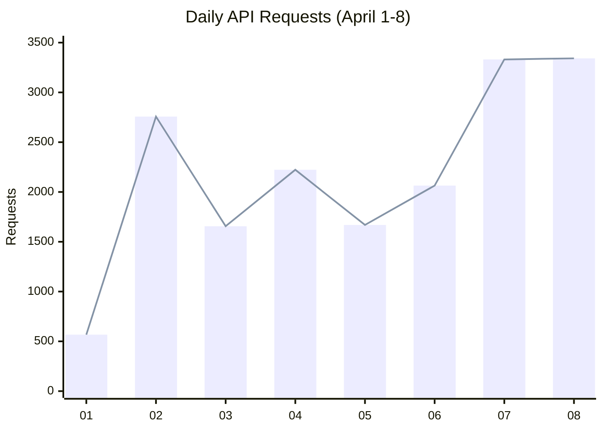
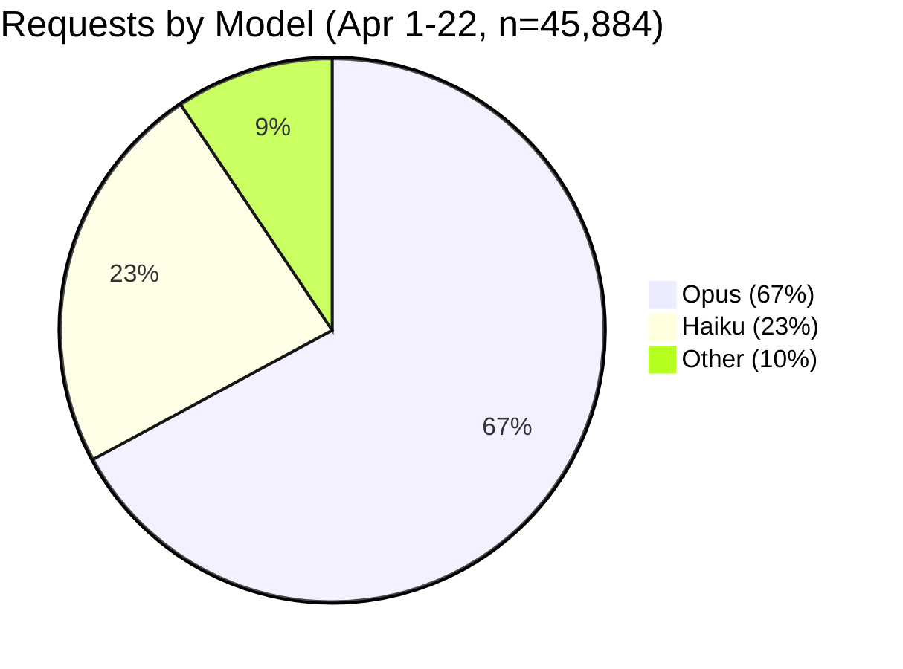
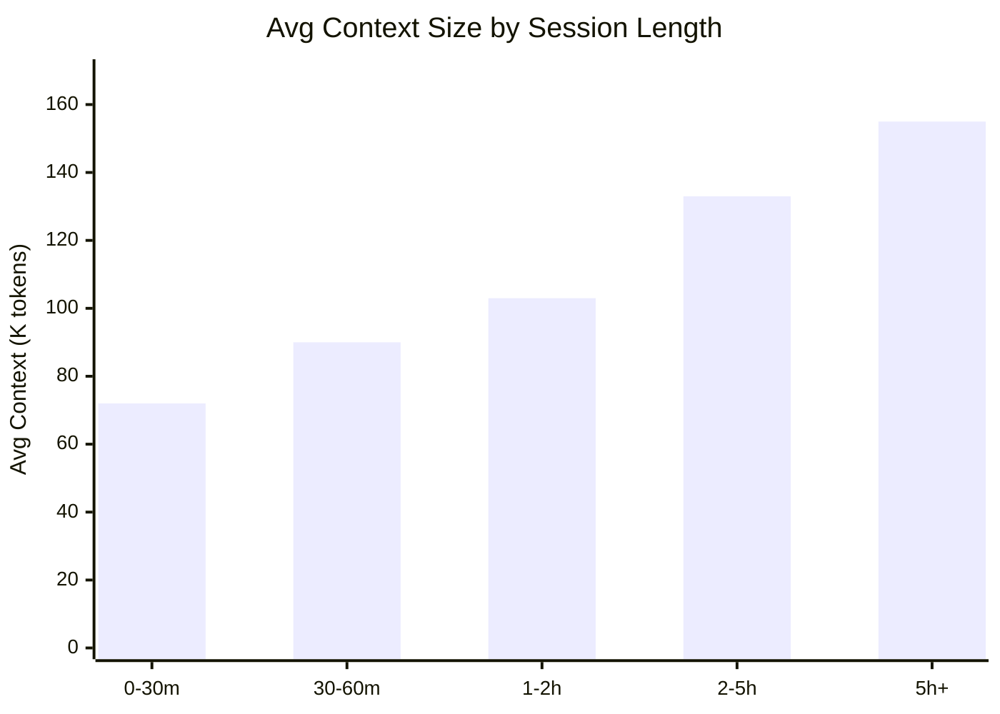
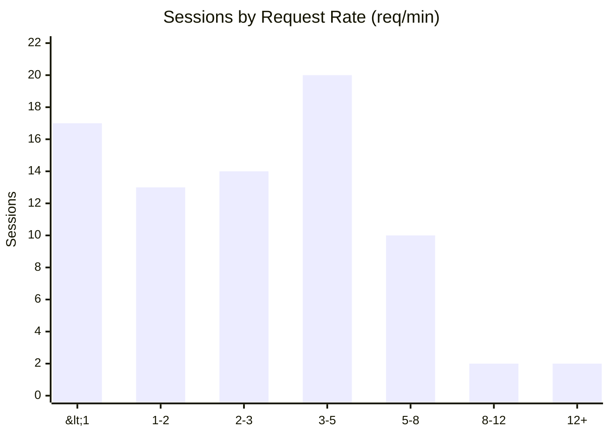
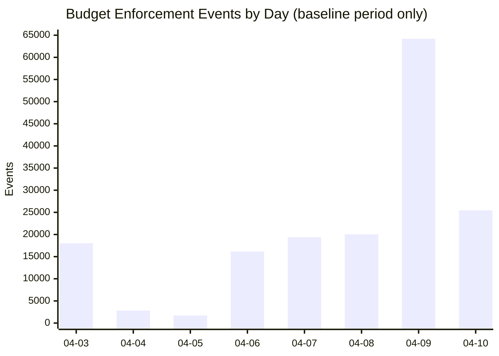
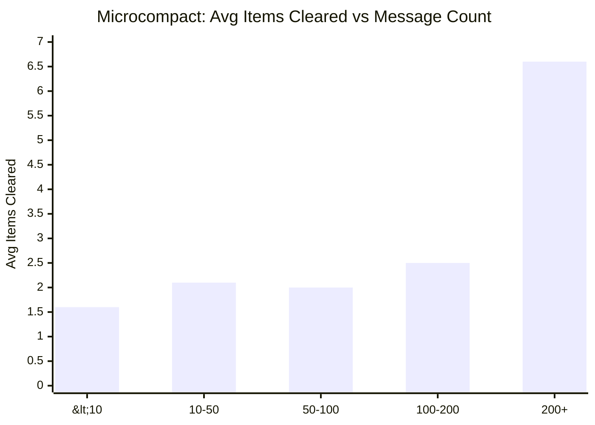
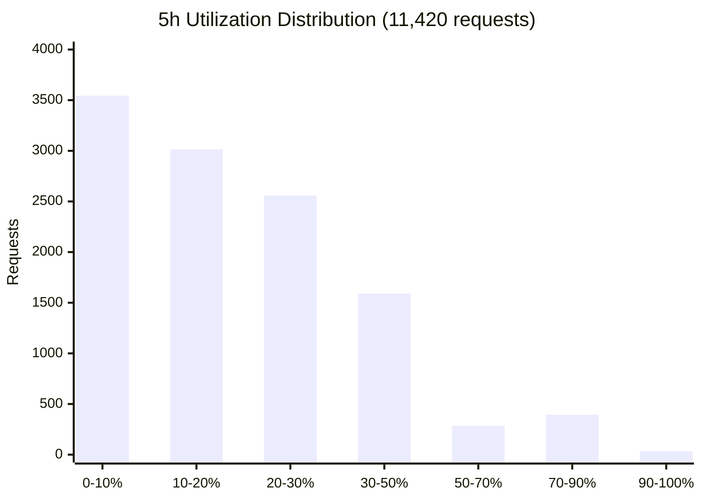
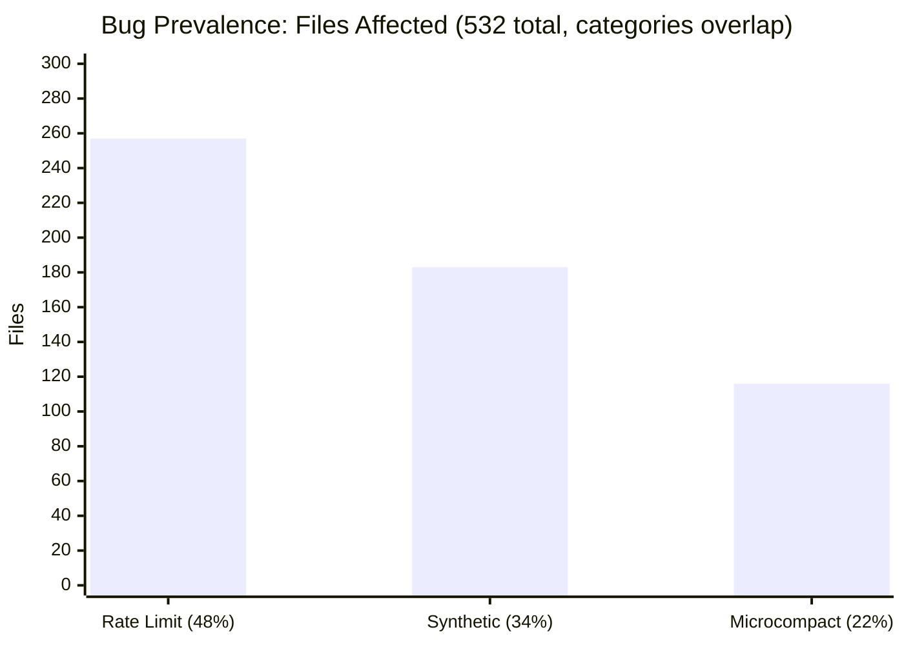
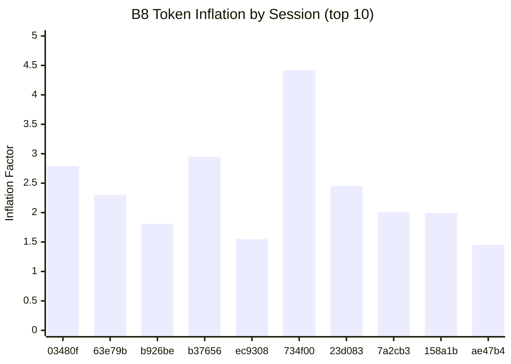

> **🇰🇷 [한국어 버전](ko/13_PROXY-DATA.md)**

# Proxy & Bulk Scan — Full Dataset

> **Date:** April 22, 2026 (data collection ongoing)
>
> **Data sources:**
> - cc-relay proxy SQLite database — **45,884 API requests intercepted (April 1–22)** across 320 unique sessions (dataset `ubuntu-1-stock`)
> - JSONL bulk scan via `jsonl_analyzer.py` — 532 session files, 158.3 MB (April 1-8, not re-run for later dates; historical snapshot)
>
> **Relationship to other documents:** [03_JSONL-ANALYSIS.md](03_JSONL-ANALYSIS.md) contains the JSONL client-side analysis (§1-8) and references key findings from this document. [01_BUGS.md](01_BUGS.md) contains bug definitions; this document provides the full measured data. [02_RATELIMIT-HEADERS.md](02_RATELIMIT-HEADERS.md) covers server-side rate limit header analysis. [14_DATA-SOURCES.md](14_DATA-SOURCES.md) explains the full data label matrix and reconciles historical snapshot figures with the current DW state.
>
> **Environment change:** On April 10, a proxy-based GrowthBook flag override was deployed. Data from **April 1–10** is from the unmodified environment (baseline). Data from **April 11 onward** is from the overridden environment. B4/B5 event counts are entirely from the baseline period. See [01_BUGS.md](01_BUGS.md#growthbook-flag-override--controlled-elimination-test-april-1014) for details. The overridden environment is also tracked as the separate dataset `ubuntu-1-override` — see [14_DATA-SOURCES.md](14_DATA-SOURCES.md).

---

## 1. Proxy Database — Overview

### 1.1 Totals

| Metric | Value (Apr 1-8) | Value (Apr 1-15) | Value (Apr 1–16, latest) |
|--------|-----------------|------------------|--------------------------|
| Total API requests | 17,610 | 35,554 | 38,996 | **45,884** |
| Unique sessions | 129 | 251 | 272 | **320** |
| Total input tokens | 12,438,471 | 28,477,426 | 31,091,542 | **36,544,950** |
| Total output tokens | 8,214,875 | 15,007,647 | 18,346,556 | **22,200,581** |
| Total cache_read | 1,692,619,956 | 2,988,290,095 | 4,084,180,976 | **5,059,406,625** |
| Total cache_creation | 38,785,293 | 64,098,470 | 78,161,480 | **99,890,766** |
| Overall cache % | — | 98.3% | 98.8% | **98.06%** |
| Date range | Apr 1–8 | Apr 1–15 | Apr 1–16 | **Apr 1–22** |

### 1.2 Daily Request Statistics

| Day | Requests | Opus | Avg Input | Avg Cache Read | Avg Cache Create | Avg Output | Cache % | Avg Latency |
|-----|----------|------|-----------|----------------|------------------|------------|---------|-------------|
| 04-01 | 567 | 468 | 626 | 72,491 | 2,757 | 455 | 87.8% | 9,600ms |
| 04-02 | 2,757 | 2,146 | 398 | 105,515 | 2,637 | 475 | 89.8% | 9,158ms |
| 04-03 | 1,656 | 1,117 | 1,587 | 155,293 | 2,328 | 484 | 75.1% | 10,224ms |
| 04-04 | 2,223 | 1,188 | 1,206 | 62,121 | 2,153 | 463 | 81.6% | 8,026ms |
| 04-05 | 1,669 | 1,191 | 657 | 78,365 | 2,582 | 443 | 78.5% | 9,355ms |
| 04-06 | 2,064 | 1,412 | 750 | 135,435 | 2,300 | 453 | 82.2% | 9,466ms |
| 04-07 | 3,331 | 2,259 | 842 | 86,336 | 1,927 | 418 | 79.6% | 8,455ms |
| 04-08 | 3,343 | 2,177 | 68 | 79,988 | 1,745 | 524 | 69.4% | 11,915ms |

---

## 2. Model Distribution (Opus vs Subagent)

| Model | Requests (Apr 1-8) | Requests (Apr 1-15) | Cache % | Total Cache Read | Total Cache Create |
|-------|--------------------|--------------------|---------|------------------|--------------------|
| **Opus** | 11,959 | **20,457** | **98.2%** | 2,849,197,725 | 52,368,359 |
| **Haiku** (subagent) | 3,781 | **7,157** | **78.2%** | 139,788,794 | 11,733,883 |
| Other/empty | 1,870 | **2,867** | 0.0% | 0 | 0 |

Haiku subagent cache efficiency improved from 58.1% (Apr 1-8) to **78.2%** (Apr 1-14) — likely due to the GrowthBook flag override eliminating B4/B5 context mutation in later sessions (subagent cold starts are less affected by already-cleared context). Opus remains stable at 98%+. The subagent gap narrowed from 40pp to 20pp.

### Model request/response verification (April 19 update)

Cross-checked `model` field in request against `raw_usage.model` in response across **41,306 requests** where both fields were present (updated April 22; previously 36,956 as of April 19):

| Request model | Response model | Count |
|---|---|---:|
| claude-opus-4-6 | claude-opus-4-6 | 28,527 |
| claude-haiku-4-5-20251001 | claude-haiku-4-5-20251001 | 8,429 |

**Zero mismatches.** Every Opus request received an Opus response; every Haiku request received Haiku. No evidence of server-side model substitution ("spoofing") in this dataset. All Haiku traffic is legitimate subagent calls — confirmed by: average request body 8× smaller than Opus (73KB vs 578KB), average `cache_read` 8× lower (19K vs 156K), and zero Haiku-only sessions (all 192 sessions with Haiku also contain Opus turns).

---

## 3. Context Growth Rate (53 Opus sessions, ≥20 requests, ≥10 min)

| Metric | tok/min |
|--------|---------|
| **Median** | **1,845** |
| P25 | 801 |
| P75 | 3,581 |
| Mean | 2,661 |
| Min | 108 |
| Max | 18,245 |

**Distribution:**
- Sessions < 1,000 tok/min: **16/53 (30%)**
- Sessions 1,000-3,000 tok/min: **22/53 (42%)**
- Sessions ≥ 3,000 tok/min: **15/53 (28%)**

The median (1,845 tok/min) is the representative context growth rate for typical Opus sessions. The widely varying range (108–18,245) reflects different workload patterns — tool-heavy sessions (many grep/read calls) grow faster than conversational ones.

---

## 4. Per-Request Cost by Session Length

| Session Length | Requests | Avg Cost (Bedrock est.) | Avg Context (input+cache) |
|----------------|----------|------------------------|--------------------------|
| 0-30min | 1,001 | $0.201 | 71,765 |
| 30-60min | 752 | $0.251 | 90,133 |
| 1-2hr | 1,378 | $0.232 | 103,101 |
| 2-5hr | 1,817 | $0.279 | 132,667 |
| **5hr+** | **7,013** | **$0.325** | **155,096** |

The general trend is that longer sessions cost more per request because accumulated context grows linearly ([03_JSONL-ANALYSIS.md §5](03_JSONL-ANALYSIS.md#5-session-lifecycle--cache-growth-curve)). The 1-2hr bucket dips below 30-60min ($0.232 vs $0.251) due to sample composition — the 1-2hr sessions in this dataset included lighter workloads. The overall trend (0-30min → 5hr+: $0.20 → $0.33) holds. This is a **structural property of all Claude Code sessions**, not version-specific. Comparing per-request costs between sessions of different lengths without controlling for duration conflates session age with version/configuration differences.

---

## 5. Cache Efficiency by Session Length

| Session Length | Sessions | Avg Cache % |
|----------------|----------|-------------|
| 0-30min | 35 | 98.7% |
| 30-60min | 9 | 98.0% |
| 1-2hr | 9 | 98.9% |
| 2-4hr | 9 | 99.0% |
| 4hr+ | 14 | 98.7% |

Cache efficiency is **stable at 98-99% across all session lengths** on v2.1.91. This confirms Bugs 1-2 (cache regression) are fully fixed and session duration does not degrade caching.

---

## 6. Request Rate Distribution

**Session-wide averages** (78 sessions, ≥5 requests, ≥60s):

| Bucket | Sessions | Avg RPM | Avg Reqs |
|--------|----------|---------|----------|
| < 1 req/min | 17 | 0.50 | 207 |
| 1-2 | 13 | 1.58 | 209 |
| 2-3 | 14 | 2.56 | 69 |
| 3-5 | 20 | 4.06 | 240 |
| 5-8 | 10 | 5.85 | 119 |
| 8-12 | 2 | 9.48 | 398 |
| **12+** | **2** | **14.12** | **32** |

The 2 sessions averaging 12+ req/min were **very short** (2-3 minutes each, ~32 requests). For sustained sessions (≥60 min), the maximum was **8.04 req/min** (session 88ca6112, 492 reqs over 61 min).

**Peak burst rates** (60-second sliding window):

| Session | Time | Reqs in 60s | Pattern |
|---------|------|-------------|---------|
| 3c77ae9a | 04-04 23:27 | **86** | 1 Opus → 40+ parallel Haiku subagents |
| 02b4424a | 04-07 20:44 | 51 | Subagent fan-out |
| 0c024075 | 04-04 11:47 | 51 | Subagent fan-out |

Burst peaks are driven by **Haiku subagent fan-out** (Agent tool spawning parallel research), not sequential user-driven requests. A single user prompt can trigger 40+ concurrent Haiku calls within seconds.

**Key implication for methodology:** Comparing session-wide req/min between different session lengths or workload types without controlling for subagent fan-out conflates user interaction rate with automated parallel calls.

---

## 7. Budget Enforcement (Bug 5) — Full Data

> **Note:** All B5 events are from the **unmodified baseline period** (April 1–10). After the GrowthBook flag override on April 10, zero B5 events were recorded across 9,996 requests. See [01_BUGS.md](01_BUGS.md#growthbook-flag-override--controlled-elimination-test-april-1014).

| Metric | Apr 3 only | Apr 1-8 | Apr 1-15 (total, all baseline) |
|--------|-----------|---------|-------------------------------|
| Total events | 261 | 59,609 | **167,818** |
| Sessions affected | 1 | ~20 | **218** |
| Truncation rate | 100% | 100% | **100%** |
| Events after override (Apr 11-15) | — | — | **0** (9,996 requests) |

**Content size distribution (n=167,818):**

| Bucket | Events | % |
|--------|--------|---|
| 0-5 chars | 10,154 | 6.1% |
| 6-10 chars | 9,274 | 5.5% |
| 11-50 chars | 148,390 | **88.4%** |

88.4% of budget enforcement events truncate tool results to 11-50 characters. The remaining 11.6% truncate to 0-10 characters. **No event retains more than 50 characters** — every tool result that crosses the budget threshold is reduced to a stub.

All events target `tool_result` (100%) — no other content types are affected.

**Truncation by session phase:**

| Phase | Events | Truncation Rate | Avg Chars |
|-------|--------|-----------------|-----------|
| Early 25% | 34,568 | 100% | 24.6 |
| Mid 50% | 28,413 | 100% | 24.6 |
| Late 25% | 9,194 | 100% | 23.5 |

Events are front-loaded — 34,568 in the first 25% of session lifetime vs 9,194 in the last 25%. This reflects tool-heavy exploration happening early in sessions, with results being truncated as the budget fills.

---

## 8. Microcompact (Bug 4) — Full Data

> **Note:** All B4 events are from the **unmodified baseline period** (April 1–10). After the GrowthBook flag override, zero B4 events across 9,996 requests.

| Metric | Apr 3 only | Apr 1-8 | Apr 1-15 (total, all baseline) |
|--------|-----------|---------|-------------------------------|
| Total events | 327 | 3,325 | **5,500** |
| Total items cleared | — | 15,998 | **18,858** |
| Events after override (Apr 11-15) | — | — | **0** (9,996 requests) |

**Cleared count distribution (n=5,500):**

| Items Cleared | Events | % |
|---------------|--------|---|
| 1 | 2,806 | 51.0% |
| 2 | 1,058 | 19.2% |
| 3-5 | 956 | 17.4% |
| 6-10 | 156 | 2.8% |
| 11-20 | 337 | 6.1% |
| 20+ | 187 | 3.4% |

**Notable pattern:** cleared_count=22 has a distinct spike of **183 events** (4.8% of total), far more than adjacent values. This suggests a **systematic batch clearing threshold** — when sessions grow long enough, Claude Code clears all 22 tool results in a single operation. This is not gradual pruning but a cliff.

**Correlation with conversation length:**

| Message Count | Events | Avg Items Cleared |
|---------------|--------|-------------------|
| < 10 | 233 | 1.6 |
| 10-50 | 764 | 2.1 |
| 50-100 | 419 | 2.0 |
| 100-200 | 612 | 2.5 |
| **200+** | **1,754** | **6.6** |

Microcompact intensifies in longer conversations — sessions with 200+ messages clear 4x more items per event than those with <10 messages. This confirms the context degradation compounds over session lifetime.

**Top affected sessions:**

| Session | Events | Total Cleared | Avg Msg Count |
|---------|--------|---------------|---------------|
| 7a2cb3bb | 746 | 1,795 | 104 |
| 03480ffe | 566 | 9,124 | 682 |
| b926be34 | 390 | 840 | 425 |
| b376562f | 363 | 376 | 333 |
| c9cd6695 | 239 | 239 | 258 |

Session 03480ffe (the 990-turn session from [03_JSONL-ANALYSIS.md §5](03_JSONL-ANALYSIS.md#5-session-lifecycle--cache-growth-curve)) had 566 microcompact events clearing 9,124 items — an average of 16 items per event and 9.2 items per conversation turn.

---

## 9. CLI Delegation Results

| CLI | Calls | Success | Avg Duration | Avg Output | Strategy |
|-----|-------|---------|-------------|------------|----------|
| claude-code | 8 | 8 (100%) | 1,584ms | 8 chars | direct/auto |
| gemini-cli | 7 | 7 (100%) | 2,247ms | 584 chars | direct/fastest |
| openai-codex | 5 | 3 (60%) | 40,672ms | 185 chars | direct |

Codex has a 60% success rate with significantly higher latency (40s avg vs 1.5-2s for Claude/Gemini). Both Codex failures were timeouts (120s, 60s).

---

## 10. Rate Limit Headers (11,420 requests with headers)

| Metric | 5h Window | 7d Window | Overage |
|--------|-----------|-----------|---------|
| Max utilization | **0.92** | 0.71 | 0.0 |
| Avg utilization | 0.20 | 0.36 | 0.0 |

**5h utilization distribution:**

| Bucket | Requests | % |
|--------|----------|---|
| 0-10% | 3,545 | 31.1% |
| 10-20% | 3,014 | 26.4% |
| 20-30% | 2,559 | 22.4% |
| 30-50% | 1,590 | 13.9% |
| 50-70% | 284 | 2.5% |
| 70-90% | 394 | 3.4% |
| 90-100% | 34 | 0.3% |

30 `allowed_warning` events occurred on April 8 between 11:32-11:57 (5h utilization 0.90-0.92). No request was ever **denied** across the entire 8-day period. `representative-claim` = `five_hour` in 100% of requests — the 5h window is always the binding constraint.

---

## 11. API Reliability

| Status Code | Count | % |
|-------------|-------|---|
| 200 (OK) | 17,627 | 99.92% |
| 529 (Overloaded) | 6 | 0.03% |
| 401 (Unauthorized) | 6 | 0.03% |
| 500 (Server Error) | 1 | 0.01% |

**99.92% success rate** across 17,634 requests. Only 14 non-200 responses in 8 days.

---

## 12. JSONL Bulk Scan (532 files, April 1-8)

> Full corpus analysis using `jsonl_analyzer.py` across all session files modified in the last 7 days.

### 12.1 Corpus Overview

| Metric | Value |
|--------|-------|
| Total JSONL files | **532** |
| Total size | **158.3 MB** |
| Total lines | **63,716** |

### 12.2 Bug Prevalence at Scale

> Note: Categories overlap — a single session file can contain multiple bug patterns. These are not mutually exclusive.

| Pattern | Files Matching | % of Corpus | Total Occurrences |
|---------|---------------|-------------|-------------------|
| Microcompact marker (`Old tool result content cleared`) | **116** | 21.8% | 549 |
| `<synthetic>` model marker | **183** | 34.4% | — |
| Rate limit text patterns | **257** | 48.3% | 3,129 |

**Microcompact** affects roughly 1 in 5 session files. **Synthetic rate limiting** appears in over a third. **Rate limit encounters** (real + synthetic combined) appear in nearly half of all sessions.

### 12.3 Extended Thinking Inflation (B8) — Top 10 Largest Sessions

| Session | Size | Entries | B8 Dup Ratio | B8 Inflation | B3 Synthetic | B6 Dup Tools |
|---------|------|---------|-------------|-------------|-------------|-------------|
| 03480ffe | 7.5 MB | 2,188 | 0.55x | **2.79x** | 4 | 10 |
| 63e79b5e | 5.6 MB | 1,914 | 0.76x | **2.30x** | 1 | 1 |
| b926be34 | 5.6 MB | 1,302 | 0.75x | 1.81x | 0 | 10 |
| b376562f | 3.9 MB | 1,399 | 0.63x | **2.95x** | 2 | 8 |
| ec930803 | 3.7 MB | 586 | 0.52x | 1.55x | 0 | 3 |
| 734f00e7 | 3.5 MB | 1,920 | 0.51x | **4.42x** | 0 | 16 |
| 23d083a1 | 3.4 MB | 1,014 | 0.95x | **2.45x** | 1 | 1 |
| 7a2cb3bb | 3.4 MB | 1,126 | 1.00x | 2.01x | 0 | 8 |
| 158a1b9d | 3.0 MB | 1,041 | 0.72x | 1.99x | 1 | 3 |
| ae47b46b | 2.5 MB | 2,007 | 0.42x | 1.45x | 1 | 7 |

**All 10 largest sessions** show PRELIM/FINAL duplication. Average token inflation: **2.37x** (range 1.45x-4.42x). The worst case (734f00e7, Forge batch monitoring) records 4.42x — 77% of logged input tokens are duplicated PRELIM entries.

**B8 is universal:** 100% of analyzed sessions exhibit this inflation. This is not an edge case.

---

*Environment: dataset `ubuntu-1-stock` — Max 20x ($200/mo), Opus 4.6 1M, v2.1.91, Linux (ubuntu-1), native `~/.claude` (CC stock mode). cc-relay proxy: **45,884 requests (April 1–22, 320 sessions)**. JSONL corpus: **2,098 files, 911 MB** (historical bulk scan: 532 files in April 1–8 window, 158.3 MB). A parallel `ubuntu-1-override` environment (same account, isolated override environment, GrowthBook flag override active since April 10) is tracked separately — see [14_DATA-SOURCES.md](14_DATA-SOURCES.md). Data collection ongoing. Three-dataset cross-validation: [CROSS-VALIDATION-20260422.md](CROSS-VALIDATION-20260422.md).*
