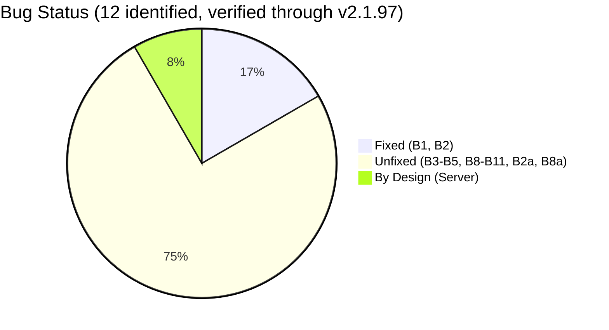

> **🇰🇷 [한국어 버전](ko/README.md)** | **🔧 [Quick fix guide →](09_QUICKSTART.md)** — skip the analysis, just fix it

# Claude Code Hidden Problem Analysis

> **TL;DR:** Claude Code has **11 confirmed client-side bugs** (B1-B5, B8, B8a, B9, B10, B11, B2a) plus **4 preliminary findings** (P1-P4). Cache bugs (B1-B2) are fixed in v2.1.91. **Nine remain unfixed as of v2.1.97** (latest). Six releases (v2.1.92–97) shipped zero fixes for token accounting, context mutation, or log integrity bugs. Additionally, proxy-captured rate limit headers reveal a **dual 5h/7d window quota system** with a significant **thinking token blind spot**. Anthropic acknowledged B11 (adaptive thinking zero-reasoning) on HN but has not followed up.
>
> **Last updated:** April 9, 2026 — Changelog cross-reference (v2.1.92–97) confirms no unfixed bug was addressed across 6 releases. See [01_BUGS.md — Changelog Cross-Reference](01_BUGS.md#changelog-cross-reference-v2192v2197) and [08_UPDATE-LOG.md](08_UPDATE-LOG.md).

---

## Latest Update (April 9)

### April 9 — 5 new bugs, 4 preliminary findings, changelog cross-reference

**5 new bugs + 4 preliminary findings** from community-wide issue/comment analysis and fact-checking (April 6-9):

| Bug | What | Evidence | Details |
|-----|------|----------|---------|
| **B8a** | JSONL non-atomic write → session corruption | ~10+ duplicates in [#21321](https://github.com/anthropics/claude-code/issues/21321) | [01_BUGS.md](01_BUGS.md#bug-8a--jsonl-non-atomic-write-corruption-v2185) |
| **B9** | `/branch` context inflation (6%→73%) | 3 duplicate issues | [01_BUGS.md](01_BUGS.md#bug-9--branch-context-inflation-all-versions) |
| **B10** | TaskOutput deprecation → 21x context injection → fatal | `has repro` | [01_BUGS.md](01_BUGS.md#bug-10--taskoutput-deprecation--autocompact-thrashing-v2192) |
| **B11** | Adaptive thinking zero-reasoning → fabrication | **Anthropic acknowledged (HN)** | [01_BUGS.md](01_BUGS.md#bug-11--adaptive-thinking-zero-reasoning-server-side-acknowledged) |
| **B2a** | SendMessage resume: cache_read=0 (even system prompt) | cnighswonger confirmed | [01_BUGS.md](01_BUGS.md#bug-2a--sendmessage-resume-cache-miss-agent-sdk) |

**Preliminary findings (MODERATE):** P1/P2 cache TTL dual tiers — two triggers for 1h→5m downgrade: telemetry disabled (`has repro`) and quota exceeded. P3 "Output efficiency" system prompt (v2.1.64). P4 third-party detection gap. See [01_BUGS.md — Preliminary Findings](01_BUGS.md#preliminary-findings-april-9-moderate--conditional-inclusion).

**Changelog cross-reference (v2.1.92–v2.1.97):** Six releases shipped zero fixes for the nine unfixed bugs. See [01_BUGS.md — Changelog Cross-Reference](01_BUGS.md#changelog-cross-reference-v2192v2197).

### April 8 — Full-week proxy dataset — [13_PROXY-DATA.md](13_PROXY-DATA.md)

cc-relay proxy database now covers **17,610 requests** across **129 sessions** (April 1-8), with automated bug detection across **532 JSONL files** (158.3 MB):

| Metric | Previous (Apr 3) | Current (Apr 1-8) | Change |
|--------|------------------|--------------------|--------|
| Budget enforcement (B5) | 261 events | **72,839 events** | 279x |
| Microcompact (B4) | 327 events | **3,782 events** (15,998 items) | 12x |
| B8 inflation (bulk scan) | 2.87x (1 session) | **2.37x avg** (10 sessions, max 4.42x) | Universal |
| Synthetic rate limit (B3) | 24 entries / 6 days | **183/532 files** (34.4%) with `<synthetic>` model entries | Pervasive |
| Context growth rate | +575 tok/turn | **median 1,845 tok/min** (53 sessions) | Statistical |

**New findings:**
- **Request rate:** Mean 2.72 req/min across 78 sessions. Sustained max 8.04 req/min (60+ min sessions). Two very short sessions (2-3 min) averaged 12+ req/min; burst peak 86 req/60s from subagent fan-out.
- **Per-request cost scales with session length:** 0-30min: $0.20/req → 5hr+: $0.33/req (structural, not version-specific)
- **Cache efficiency stable:** 98-99% across all session lengths on v2.1.91 (Bugs 1-2 fully fixed)
- **Subagent gap:** Haiku 58.1% cache vs Opus 98.8% — 40pp gap persists
- **Microcompact intensifies:** 1.6 items/event at <10 messages → 6.6 items/event at 200+ messages

### Rate limit header analysis — [02_RATELIMIT-HEADERS.md](02_RATELIMIT-HEADERS.md)

Transparent proxy (cc-relay) captured `anthropic-ratelimit-unified-*` headers across **3,702 requests** (April 4-6), revealing the server-side quota architecture:

**Dual sliding window system:**
- Two independent counters: **5-hour** (`5h-utilization`) and **7-day** (`7d-utilization`)
- `representative-claim` = `five_hour` in **100%** of requests — the 5h window is always the bottleneck
- 5h windows reset on roughly 5-hour intervals; 7d resets weekly (April 10, 12:00 KST for this account)

**Per-1% utilization cost** (measured across 5 active windows on Max 20x / $200/mo):

| Metric | Range | Note |
|--------|-------|------|
| Output per 1% | 9K-16K | Visible output only (thinking excluded) |
| Cache Read per 1% | 1.5M-2.1M | 96-99% of visible token volume |
| Total Visible per 1% | 1.5M-2.1M | Output + Cache Read + Input |
| 7d accumulation ratio | 0.12-0.17 | 7d_delta relative to 5h_peak |

**Thinking token blind spot:** Extended thinking tokens are **not included** in the `output_tokens` field from the API. At 9K-16K visible output per 1%, a full 5h window (100%) = only 0.9M-1.6M visible output tokens — low for several hours of Opus work. The gap is consistent with thinking tokens being counted against the quota, but the exact mechanism can't be confirmed from the client side. Thinking-disabled isolation test planned for the week of April 6.

**Community cross-validation:**
- [@fgrosswig](https://github.com/fgrosswig): [64x budget reduction](https://github.com/anthropics/claude-code/issues/38335#issuecomment-4189537353) — dual-machine 18-day JSONL forensics (Mar 26: 3.2B tokens no limit → Apr 5: 88M at 90%)
- [@Commandershadow9](https://github.com/Commandershadow9): [34-143x capacity reduction](https://github.com/anthropics/claude-code/issues/41506#issuecomment-4189508296) — cache fix confirmed, capacity drop independent of cache bug, thinking token hypothesis

**v2.1.89 separation:** The cache regression (Mar 28 - Apr 1) is a separate, resolved issue. The capacity reduction exists independently — clean comparison: golden period (Mar 23-27, cache 98-99%) vs post-fix (Apr 2+, cache 84-97%), both with healthy cache. Data collection ongoing through April 10 (full 7d cycle).

---

## Current Status (April 9, 2026 — verified through v2.1.97)

Cache regression (v2.1.89) is **fixed** in v2.1.90-91. **Nine client-side bugs remain unfixed through v2.1.97** (latest, 6 releases later). Changelog cross-reference: [01_BUGS.md § Changelog Cross-Reference](01_BUGS.md#changelog-cross-reference-v2192v2197).

| Bug | What It Does | Impact | Status | Details |
|-----|-------------|--------|--------|---------|
| **B1** Sentinel | Standalone binary corrupts cache prefix | 4-17% cache read (v2.1.89) | **Fixed** | [01_BUGS.md](01_BUGS.md#bug-1--sentinel-replacement-standalone-binary-only) |
| **B2** Resume | `--resume` replays full context uncached | Full cache miss per resume | **Fixed** | [01_BUGS.md](01_BUGS.md#bug-2--resume-cache-breakage-v2169) |
| **B2a** SendMessage | Agent SDK SendMessage resume: full cache miss including system prompt | cache_read=0 on first resume | **Unclear** | [01_BUGS.md](01_BUGS.md#bug-2a--sendmessage-resume-cache-miss-agent-sdk) |
| **B3** False RL | Client blocks API calls with fake error | Instant "Rate limit reached" | **Unfixed** | [01_BUGS.md](01_BUGS.md#bug-3--client-side-false-rate-limiter-all-versions) |
| **B4** Microcompact | Tool results silently cleared mid-session | 3,782 events, 15,998 items cleared | **Unfixed** | [01_BUGS.md](01_BUGS.md#bug-4--silent-microcompact--context-quality-degradation-all-versions-server-controlled) |
| **B5** Budget cap | 200K aggregate limit on tool results | 72,839 events, 100% truncation | **Unfixed** | [01_BUGS.md](01_BUGS.md#bug-5--tool-result-budget-enforcement-all-versions) |
| **B8** Log inflation | Extended thinking duplicates JSONL entries | 2.37x avg (max 4.42x), universal | **Unfixed** | [01_BUGS.md](01_BUGS.md#bug-8--jsonl-log-duplication-all-versions) |
| **B8a** JSONL corruption | Concurrent tool execution drops tool_result → permanent 400 | ~10+ duplicates in #21321 | **Unfixed** | [01_BUGS.md](01_BUGS.md#bug-8a--jsonl-non-atomic-write-corruption-v2185) |
| **B9** /branch inflation | Message duplication/un-compaction on branch | 6%→73% context in one message | **Unfixed** | [01_BUGS.md](01_BUGS.md#bug-9--branch-context-inflation-all-versions) |
| **B10** TaskOutput thrash | Deprecation message triggers 21x context injection → fatal | 87K vs 4K, triple autocompact | **Unfixed** | [01_BUGS.md](01_BUGS.md#bug-10--taskoutput-deprecation--autocompact-thrashing-v2192) |
| **B11** Zero reasoning | Adaptive thinking emits zero reasoning → fabrication | **Anthropic acknowledged** | Investigating | [01_BUGS.md](01_BUGS.md#bug-11--adaptive-thinking-zero-reasoning-server-side-acknowledged) |
| **Server** | Quota architecture + thinking token accounting | Reduced effective capacity | **By design** | [02_RATELIMIT-HEADERS.md](02_RATELIMIT-HEADERS.md) |

### What You Can Do

1. **Update to v2.1.91+** — fixes the cache regression (worst drain). v2.1.92–97 add no bug fixes for issues tracked here but are safe to use
2. **npm or standalone — both fine on v2.1.91** (Sentinel gap closed)
3. **Don't use `--resume` or `--continue`** — replays full context as billable input
4. **Start fresh sessions periodically** — the 200K tool result cap (B5) silently truncates older results
5. **Avoid `/dream` and `/insights`** — background API calls that drain silently

See [09_QUICKSTART.md](09_QUICKSTART.md) for setup guide and self-diagnosis. Full proxy dataset: **[13_PROXY-DATA.md](13_PROXY-DATA.md)**.

---

## Server-Side Factors (Unresolved)

Even with cache at 95-99%, drain persists. At least four server-side issues contribute:

**1. Server-side accounting change:** Old Docker versions (v2.1.74, v2.1.86 — never updated) started draining fast recently, proving the issue isn't purely client-side ([#37394](https://github.com/anthropics/claude-code/issues/37394)).

**2. 1M context billing regression:** A late-March regression causes the server to incorrectly classify Max plan 1M context requests as "extra usage." Debug logs show a 429 error at only ~23K tokens ([#42616](https://github.com/anthropics/claude-code/issues/42616)).

**3. Dual-window quota + thinking token blind spot:** 5h + 7d independent windows. Visible output only 9K-16K per 1% — the gap is likely thinking tokens counted against quota but invisible to clients. Full analysis: [02_RATELIMIT-HEADERS.md](02_RATELIMIT-HEADERS.md).

**4. Org-level quota sharing:** Accounts under the same organization share rate limit pools. `passesEligibilityCache` and `overageCreditGrantCache` are keyed by `organizationUuid`, not `accountUuid`. Originally discovered by [@dancinlife](https://github.com/dancinlife) through client-side analysis of the obfuscated JavaScript bundle.

---

## Usage Precautions

See **[09_QUICKSTART.md](09_QUICKSTART.md)** for the full list of behaviors to avoid and adopt, including `/branch`, `/release-notes`, and environment variable recommendations.

---

## Background

### How this started

On April 1, 2026, my Max 20 plan ($200/mo) hit 100% usage in ~70 minutes during normal coding. JSONL analysis showed the session averaging **36.1% cache read** (min 21.1%) where it should have been 90%+. Every token was being billed at full price.

Downgrading from v2.1.89 to v2.1.68 immediately recovered cache to **97.6%** — confirming the regression was version-specific. I set up a transparent monitoring proxy (cc-relay) to capture per-request data going forward.

What started as personal debugging quickly expanded. Dozens of users were reporting the same symptoms across what became [91+ GitHub issues](10_ISSUES.md). Community members — [@Sn3th](https://github.com/Sn3th), [@rwp65](https://github.com/rwp65), [@fgrosswig](https://github.com/fgrosswig), [@Commandershadow9](https://github.com/Commandershadow9), and [12 others](10_ISSUES.md#contributors--acknowledgments) — independently found different pieces of the puzzle.

**The investigation timeline:**

| Date | What happened |
|------|--------------|
| Apr 1 | 70-minute 100% drain → v2.1.89 regression confirmed, proxy setup |
| Apr 2 | Bugs 3-4 discovered (false rate limiter, silent microcompact). Anthropic's Lydia Hallie posts on X |
| Apr 3 | Bug 5 discovered (200K budget cap). v2.1.91 benchmark: cache fixed, 4 other active bugs persist (B3-B5, B8). [06_TEST-RESULTS-0403.md](06_TEST-RESULTS-0403.md) |
| Apr 4-6 | cc-relay captures 3,702 requests with rate limit headers. Community analysis continues |
| Apr 6 | Dual-window quota analysis published. Community cross-validation (fgrosswig 64x, Commandershadow9 34-143x). [02_RATELIMIT-HEADERS.md](02_RATELIMIT-HEADERS.md) |

Full 14-month chronicle (Feb 2025 – Apr 2026): [07_TIMELINE.md](07_TIMELINE.md)

### Anthropic's Position (April 2)

Lydia Hallie (Anthropic, Product) [posted on X](https://x.com/lydiahallie/status/2039800715607187906):

> *"Peak-hour limits are tighter and 1M-context sessions got bigger, that's most of what you're feeling. We fixed a few bugs along the way, but none were over-charging you."*

She [recommended](https://x.com/lydiahallie/status/2039800718371307603) using Sonnet as default, lowering effort level, starting fresh instead of resuming, and capping context with `CLAUDE_CODE_AUTO_COMPACT_WINDOW=200000`.

**Where our data diverges from this assessment:**

- **"None were over-charging you"** — Bug 5 silently truncates tool results to 1-49 chars after a 200K aggregate threshold. Users paying for 1M context effectively have a 200K tool result budget for built-in tools. 261 truncation events measured in a single session.
- **"We fixed a few bugs"** — Cache bugs (B1-B2) are fixed, but Bugs 3-5 and B8 remain active in v2.1.91. Client-side false rate limiter (B3) generated 151 synthetic "Rate limit reached" errors across 65 sessions on our setup — zero API calls made.
- **"Peak-hour limits are tighter"** — Our April 6 proxy data shows the bottleneck is always the 5h window (`representative-claim` = `five_hour` in 100% of 3,702 requests), regardless of time of day. Weekend and off-peak data shows the same pattern.
- **Thinking token accounting** — Extended thinking tokens don't appear in `output_tokens` from the API, yet visible output alone explains less than half the observed utilization cost. If thinking tokens are counted against quota at output-token rate, this is a significant invisible cost that users have no way to monitor or control.

**GitHub response:** bcherny posted 6 comments on [#42796](https://github.com/anthropics/claude-code/issues/42796) (April 6 only, triggered by HN virality), then went silent. Zero responses on all other 90+ issues including #38335 (478 comments, 15 days). See [10_ISSUES.md](10_ISSUES.md#anthropic-official-response) for full history.

### Cache TTL (not a bug)

[@luongnv89](https://github.com/luongnv89) [documented](https://github.com/luongnv89/cc-context-stats/blob/main/context-stats-cache-misses.md) that idle gaps of 13+ hours cause a full cache rebuild. Anthropic documents a 5-minute TTL, though our data shows 5-26 minute gaps sometimes maintaining 96%+ cache — the actual TTL may be longer in practice. Not a bug, but worth knowing about.

---

## Documents

| File | What | Updated |
|------|------|---------|
| **[01_BUGS.md](01_BUGS.md)** | All 11 bugs (B1-B11, B2a, B8a) + 4 preliminary (P1-P4) + changelog cross-reference (v2.1.92-97) | Apr 9 |
| **[09_QUICKSTART.md](09_QUICKSTART.md)** | Quick fix guide — Option A (v2.1.91+) vs Option B (v2.1.63 downgrade), npm vs standalone, diagnosis | Apr 9 |
| **[07_TIMELINE.md](07_TIMELINE.md)** | 14-month chronicle (Phase 1-9) + April 6-9 community acceleration + Anthropic response | Apr 9 |
| **[08_UPDATE-LOG.md](08_UPDATE-LOG.md)** | Daily investigation log + changelog cross-reference | Apr 9 |
| **[10_ISSUES.md](10_ISSUES.md)** | 91+ tracked issues + community tools + contributors | Apr 9 |
| **[13_PROXY-DATA.md](13_PROXY-DATA.md)** | Full-week proxy dataset (17,610 requests, 129 sessions) with Mermaid visualizations | Apr 8 |
| **[02_RATELIMIT-HEADERS.md](02_RATELIMIT-HEADERS.md)** | Dual 5h/7d window architecture, per-1% cost, thinking token blind spot | Apr 6 |
| **[03_JSONL-ANALYSIS.md](03_JSONL-ANALYSIS.md)** | Session log analysis: PRELIM inflation, subagent costs, lifecycle curve, proxy cross-validation | Apr 6 |
| **[05_MICROCOMPACT.md](05_MICROCOMPACT.md)** | Deep dive: silent context stripping (Bug 4) + tool result budget (Bug 5) | Apr 3 |
| **[04_BENCHMARK.md](04_BENCHMARK.md)** | npm vs standalone benchmark with raw per-request data | Apr 3 |
| **[06_TEST-RESULTS-0403.md](06_TEST-RESULTS-0403.md)** | April 3 integrated test results — all bugs verified | Apr 3 |
| **[11_USAGE-GUIDE.md](11_USAGE-GUIDE.md)** | Essential usage guide — sessions, context, CLAUDE.md, token-saving | Apr 8 |
| **[12_ADVANCED-GUIDE.md](12_ADVANCED-GUIDE.md)** | Power user guide — hooks, subagents, monitoring, rate limit tactics | Apr 8 |

## Environment

- **Plan:** Max 20 ($200/mo)
- **OS:** Linux (Ubuntu), Linux workstation (ubuntu-1)
- **Versions tested:** v2.1.91 (benchmark), v2.1.90, v2.1.89, v2.1.68. Changelog verified through **v2.1.97**
- **Monitoring:** cc-relay v2 transparent proxy (17,610 requests, 11,420 with rate limit headers as of April 8)
- **Date:** April 9, 2026

---

## Contributors

This analysis builds on work by many community members who independently investigated and measured these issues. Full details in [10_ISSUES.md](10_ISSUES.md#contributors--acknowledgments).

| Who | Key Contribution |
|-----|-----------------|
| [@Sn3th](https://github.com/Sn3th) | Discovered microcompact mechanisms (Bug 4), GrowthBook flags, budget pipeline (Bug 5) |
| [@rwp65](https://github.com/rwp65) | Discovered client-side false rate limiter (Bug 3) |
| [@cnighswonger](https://github.com/cnighswonger) | Built [cache-fix interceptor](https://github.com/cnighswonger/claude-code-cache-fix) — 4,700 calls, 98.3% cache hit, TTL tier detection |
| [@wpank](https://github.com/wpank) | 47,810 requests tracked, v2.1.63 vs v2.1.96 quantitative comparison |
| [@fgrosswig](https://github.com/fgrosswig) | 64x budget reduction forensics — 18-day JSONL analysis |
| [@Commandershadow9](https://github.com/Commandershadow9) | 34-143x capacity reduction analysis, thinking token hypothesis |
| [@kolkov](https://github.com/kolkov) | Built [ccdiag](https://github.com/kolkov/ccdiag), identified v2.1.91 resume regressions |
| [@simpolism](https://github.com/simpolism) | Resume cache fix patch (99.7-99.9% hit) |
| [@bilby91](https://github.com/bilby91) | Identified skill_listing + companion_intro cache miss on resume |
| [@labzink](https://github.com/labzink) | Identified SendMessage cache full miss (Bug 2a) |
| [@wjordan](https://github.com/wjordan) | Found "Output efficiency" system prompt change via [Piebald-AI](https://github.com/Piebald-AI/claude-code-system-prompts) |
| [@EmpireJones](https://github.com/EmpireJones) | Discovered telemetry-cache TTL coupling (Anthropic `has repro`) |
| [@dancinlife](https://github.com/dancinlife) | organizationUuid quota pooling discovery |
| [@luongnv89](https://github.com/luongnv89) | Cache TTL analysis, built [CUStats](https://custats.info) |
| [@weilhalt](https://github.com/weilhalt) | Built [BudMon](https://github.com/weilhalt/budmon) for rate-limit monitoring |
| [@arizonawayfarer](https://github.com/arizonawayfarer) | GrowthBook flag dumps, acompact tool duplication analysis (35%) |
| [@progerzua](https://github.com/progerzua) | `/branch` context inflation measurement (Bug 9) |
| Reddit community | [Reverse engineering](https://www.reddit.com/r/ClaudeAI/s/AY2GHQa5Z6) of cache sentinel mechanism |

*This analysis is based on community research and personal measurement. It is not endorsed by Anthropic. All workarounds use only official tools and documented features.*
