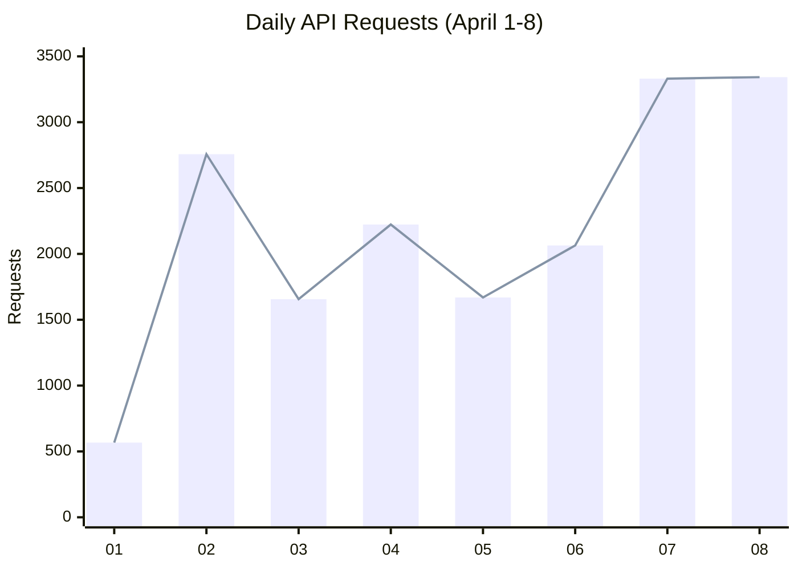
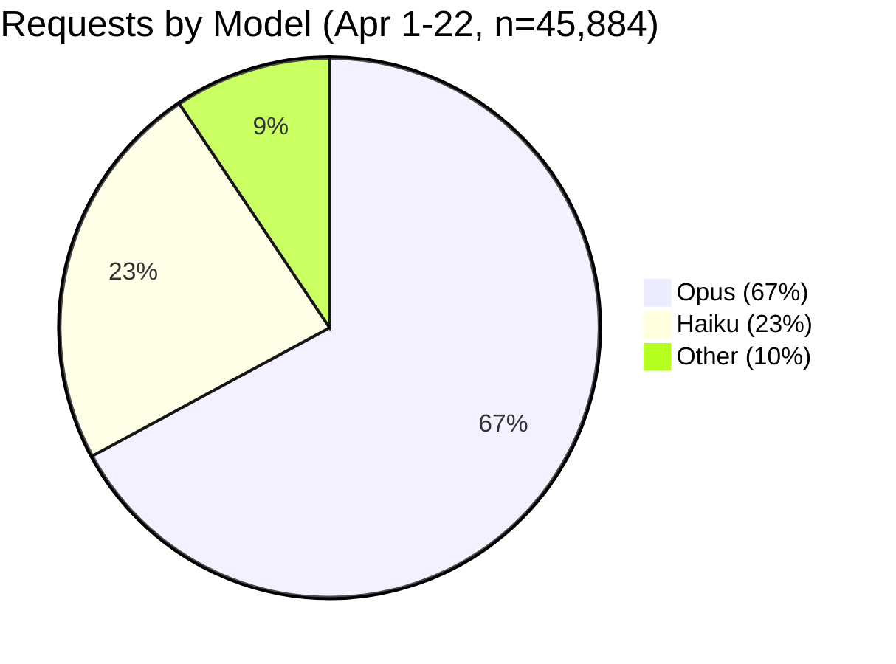
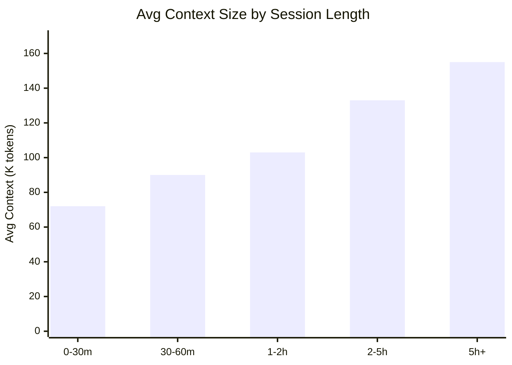
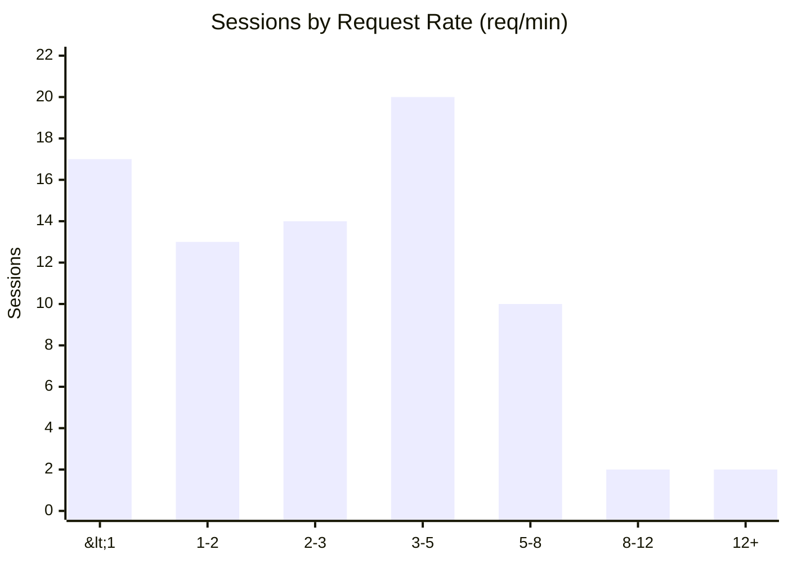
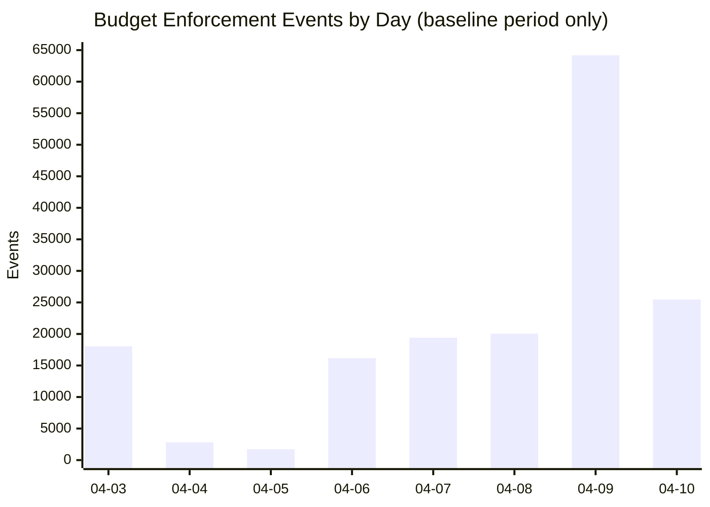
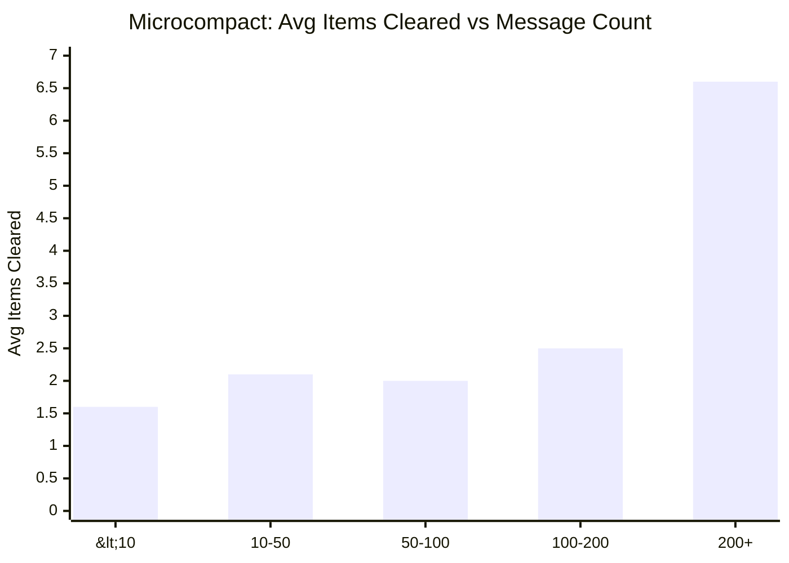
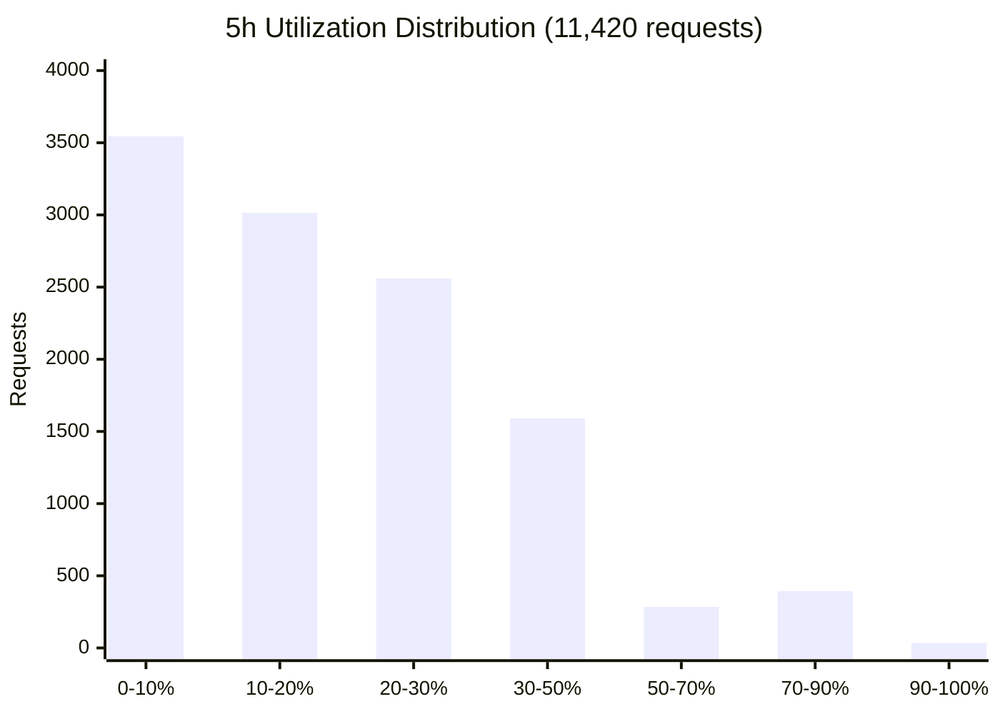
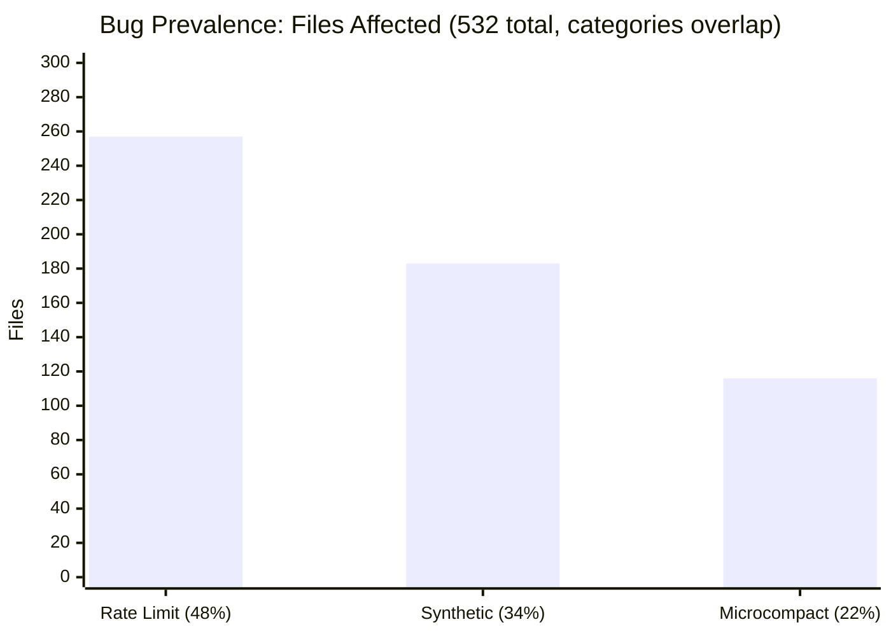
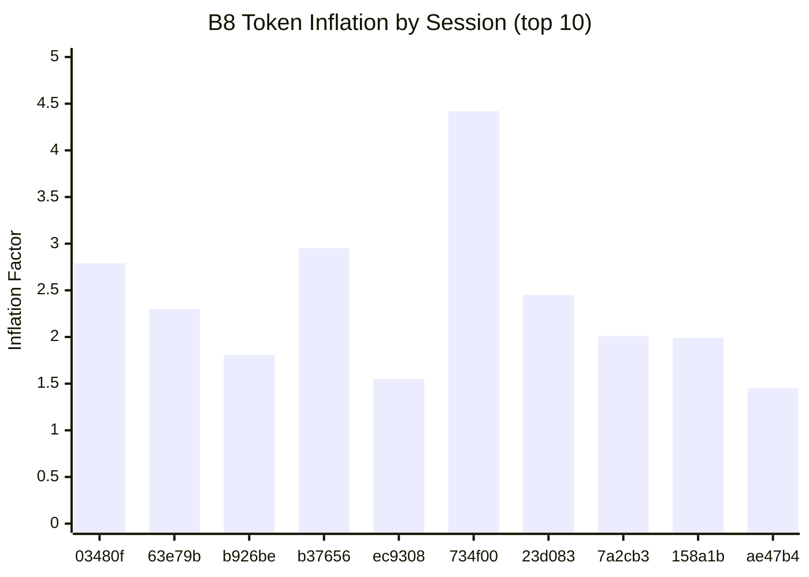

> **🇺🇸 [English Version](../13_PROXY-DATA.md)**

# 프록시 & 대규모 스캔 — 전체 데이터셋

> **날짜:** 2026년 4월 22일 (데이터 수집 진행 중)
>
> **데이터 소스:**
> - cc-relay 프록시 SQLite 데이터베이스 — **45,884건의 API 요청 가로채기 (4월 1–22일)**, 320개 고유 세션에 걸침(데이터셋 `ubuntu-1-stock`)
> - `jsonl_analyzer.py`를 이용한 JSONL 일괄 스캔 — 532개 세션 파일, 158.3 MB (4월 1–8일, 이후 날짜에 대해서는 재실행하지 않음. 과거 스냅샷)
>
> **다른 문서와의 관계:** [03_JSONL-ANALYSIS.md](03_JSONL-ANALYSIS.md)는 JSONL 클라이언트 측 분석 (§1-8)을 담고 있으며, 이 문서의 주요 발견사항을 참조합니다. [01_BUGS.md](01_BUGS.md)는 버그 정의를 담고 있으며, 이 문서는 전체 측정 데이터를 제공합니다. [02_RATELIMIT-HEADERS.md](02_RATELIMIT-HEADERS.md)는 서버 측 rate limit 헤더 분석을 다룹니다. [14_DATA-SOURCES.md](14_DATA-SOURCES.md)는 전체 데이터 라벨 매트릭스와, 과거 스냅샷 수치가 현재 DW 상태와 어떻게 조정되는지 설명합니다.
>
> **환경 변화:** 4월 10일에 프록시 기반 GrowthBook 플래그 오버라이드가 배포되었습니다. **4월 1~10일** 데이터는 수정되지 않은 환경(기준선)에서 수집된 것입니다. **4월 11일 이후** 데이터는 오버라이드된 환경에서 수집된 것입니다. B4/B5 이벤트 건수는 전부 기준선 기간에서 발생한 것입니다. 상세 내용은 [01_BUGS.md](01_BUGS.md#growthbook-flag-override--controlled-elimination-test-april-1014)를 참조하십시오. 오버라이드된 환경은 별도 데이터셋 `ubuntu-1-override`로도 추적됩니다 — [14_DATA-SOURCES.md](14_DATA-SOURCES.md) 참조.

---

## 1. 프록시 데이터베이스 — 개요

### 1.1 총계

| 지표 | 값 (4월 1-8일) | 값 (4월 1-15일) | 값 (4월 1–16일) | 값 (4월 1–22일, 최신) |
|------|-----------------|------------------|------------------|--------------------------|
| 총 API 요청 수 | 17,610 | 35,554 | 38,996 | **45,884** |
| 고유 세션 수 | 129 | 251 | 272 | **320** |
| 총 input 토큰 | 12,438,471 | 28,477,426 | 31,091,542 | **36,544,950** |
| 총 output 토큰 | 8,214,875 | 15,007,647 | 18,346,556 | **22,200,581** |
| 총 cache_read | 1,692,619,956 | 2,988,290,095 | 4,084,180,976 | **5,059,406,625** |
| 총 cache_creation | 38,785,293 | 64,098,470 | 78,161,480 | **99,890,766** |
| 전체 cache % | — | 98.3% | 98.8% | **98.06%** |
| 기간 | 4월 1~8일 | 4월 1~15일 | 4월 1~16일 | **4월 1~22일** |

### 1.2 일별 요청 통계

| 일자 | 요청 수 | Opus | 평균 Input | 평균 Cache Read | 평균 Cache Create | 평균 Output | Cache % | 평균 지연시간 |
|------|---------|------|-----------|----------------|------------------|------------|---------|-------------|
| 04-01 | 567 | 468 | 626 | 72,491 | 2,757 | 455 | 87.8% | 9,600ms |
| 04-02 | 2,757 | 2,146 | 398 | 105,515 | 2,637 | 475 | 89.8% | 9,158ms |
| 04-03 | 1,656 | 1,117 | 1,587 | 155,293 | 2,328 | 484 | 75.1% | 10,224ms |
| 04-04 | 2,223 | 1,188 | 1,206 | 62,121 | 2,153 | 463 | 81.6% | 8,026ms |
| 04-05 | 1,669 | 1,191 | 657 | 78,365 | 2,582 | 443 | 78.5% | 9,355ms |
| 04-06 | 2,064 | 1,412 | 750 | 135,435 | 2,300 | 453 | 82.2% | 9,466ms |
| 04-07 | 3,331 | 2,259 | 842 | 86,336 | 1,927 | 418 | 79.6% | 8,455ms |
| 04-08 | 3,343 | 2,177 | 68 | 79,988 | 1,745 | 524 | 69.4% | 11,915ms |

---

## 2. 모델 분포 (Opus vs 서브에이전트)

| 모델 | 요청 수 (4월 1-8일) | 요청 수 (4월 1-15일) | Cache % | 총 Cache Read | 총 Cache Create |
|------|--------------------|--------------------|---------|------------------|--------------------|
| **Opus** | 11,959 | **20,457** | **98.2%** | 2,849,197,725 | 52,368,359 |
| **Haiku** (서브에이전트) | 3,781 | **7,157** | **78.2%** | 139,788,794 | 11,733,883 |
| 기타/빈 값 | 1,870 | **2,867** | 0.0% | 0 | 0 |

Haiku 서브에이전트의 캐시 효율이 58.1% (4월 1-8일)에서 **78.2%** (4월 1-14일)로 향상되었습니다. 이는 GrowthBook 플래그 오버라이드가 이후 세션에서 B4/B5 컨텍스트 변이를 제거한 덕분으로 보입니다 (서브에이전트의 콜드 스타트는 이미 정리된 컨텍스트의 영향을 덜 받습니다). Opus는 98% 이상으로 안정적입니다. 서브에이전트와의 격차가 40 퍼센트포인트에서 20 퍼센트포인트로 줄었습니다.

---

## 3. 컨텍스트 성장률 (Opus 세션 53개, 요청 20건 이상, 10분 이상)

| 지표 | tok/min |
|------|---------|
| **중앙값** | **1,845** |
| P25 | 801 |
| P75 | 3,581 |
| 평균 | 2,661 |
| 최솟값 | 108 |
| 최댓값 | 18,245 |

**분포:**
- 1,000 tok/min 미만 세션: **16/53 (30%)**
- 1,000-3,000 tok/min 세션: **22/53 (42%)**
- 3,000 tok/min 이상 세션: **15/53 (28%)**

중앙값(1,845 tok/min)은 일반적인 Opus 세션의 대표적인 컨텍스트 성장률입니다. 넓은 범위(108–18,245)는 작업 유형에 따른 차이를 반영합니다 — 도구를 많이 사용하는 세션(grep/read 호출이 잦은 경우)은 대화 위주 세션보다 빠르게 성장합니다.

---

## 4. 세션 길이별 요청당 비용

| 세션 길이 | 요청 수 | 평균 비용 (Bedrock 추정) | 평균 컨텍스트 (input+cache) |
|-----------|---------|------------------------|--------------------------|
| 0-30min | 1,001 | $0.201 | 71,765 |
| 30-60min | 752 | $0.251 | 90,133 |
| 1-2hr | 1,378 | $0.232 | 103,101 |
| 2-5hr | 1,817 | $0.279 | 132,667 |
| **5hr+** | **7,013** | **$0.325** | **155,096** |

전반적인 추세는 세션이 길어질수록 누적 컨텍스트가 선형으로 증가하기 때문에 요청당 비용이 높아진다는 것입니다 ([03_JSONL-ANALYSIS.md §5](03_JSONL-ANALYSIS.md#5-session-lifecycle--cache-growth-curve)). 1-2시간 구간이 30-60분보다 낮은 이유는($0.232 vs $0.251) 표본 구성 때문입니다 — 이 데이터셋의 1-2시간 세션에 가벼운 작업이 포함되었습니다. 전체 추세(0-30분 → 5시간+: $0.20 → $0.33)는 유지됩니다. 이것은 특정 버전이 아닌 **모든 Claude Code 세션의 구조적 특성**입니다. 세션 길이가 다른 경우 지속 시간을 통제하지 않고 요청당 비용을 비교하면, 세션 경과 시간과 버전/설정 차이를 혼동하게 됩니다.

---

## 5. 세션 길이별 캐시 효율

| 세션 길이 | 세션 수 | 평균 Cache % |
|-----------|---------|-------------|
| 0-30min | 35 | 98.7% |
| 30-60min | 9 | 98.0% |
| 1-2hr | 9 | 98.9% |
| 2-4hr | 9 | 99.0% |
| 4hr+ | 14 | 98.7% |

캐시 효율은 v2.1.91에서 **모든 세션 길이에 걸쳐 98-99%로 안정적**입니다. 이는 버그 1-2(캐시 퇴행)가 완전히 수정되었으며, 세션 지속 시간이 캐싱을 저하시키지 않는다는 것을 확인해줍니다.

---

## 6. 요청 속도 분포

**세션 전체 평균** (78개 세션, 요청 5건 이상, 60초 이상):

| 구간 | 세션 수 | 평균 RPM | 평균 요청 수 |
|------|---------|---------|------------|
| < 1 req/min | 17 | 0.50 | 207 |
| 1-2 | 13 | 1.58 | 209 |
| 2-3 | 14 | 2.56 | 69 |
| 3-5 | 20 | 4.06 | 240 |
| 5-8 | 10 | 5.85 | 119 |
| 8-12 | 2 | 9.48 | 398 |
| **12+** | **2** | **14.12** | **32** |

12+ req/min을 기록한 2개 세션은 **매우 짧은 세션**이었습니다 (각각 2-3분, 약 32건 요청). 지속 세션(60분 이상)의 최대치는 **8.04 req/min** (세션 88ca6112, 61분간 492건)이었습니다.

**순간 최대 속도** (60초 슬라이딩 윈도우):

| 세션 | 시각 | 60초 내 요청 수 | 패턴 |
|------|------|----------------|------|
| 3c77ae9a | 04-04 23:27 | **86** | Opus 1건 → Haiku 서브에이전트 40건 이상 병렬 실행 |
| 02b4424a | 04-07 20:44 | 51 | 서브에이전트 팬아웃 |
| 0c024075 | 04-04 11:47 | 51 | 서브에이전트 팬아웃 |

순간 최대치는 사용자의 순차적 요청이 아닌 **Haiku 서브에이전트 팬아웃**(Agent 도구가 병렬 조사를 위해 동시 실행하는 것)에 의해 발생합니다. 단일 사용자 프롬프트가 수 초 내에 40건 이상의 동시 Haiku 호출을 유발할 수 있습니다.

**방법론에 대한 핵심 시사점:** 서브에이전트 팬아웃을 통제하지 않고 세션 길이나 작업 유형이 다른 세션 간 req/min을 비교하면, 사용자의 상호작용 빈도와 자동화된 병렬 호출을 혼동하게 됩니다.

---

## 7. Budget Enforcement (버그 5) — 전체 데이터

> **참고:** 모든 B5 이벤트는 **수정되지 않은 기준선 기간** (4월 1~10일)에서 발생한 것입니다. 4월 10일의 GrowthBook 플래그 오버라이드 이후, 9,996건의 요청에서 B5 이벤트는 0건이었습니다. 상세 내용은 [01_BUGS.md](01_BUGS.md#growthbook-flag-override--controlled-elimination-test-april-1014)를 참조하십시오.

| 지표 | 4월 3일만 | 4월 1-8일 | 4월 1-15일 (합계, 전부 기준선) |
|------|-----------|---------|-------------------------------|
| 총 이벤트 수 | 261 | 59,609 | **167,818** |
| 영향받은 세션 수 | 1 | ~20 | **218** |
| 잘림 비율 | 100% | 100% | **100%** |
| 오버라이드 이후 이벤트 (4월 11-15일) | — | — | **0** (9,996건 요청) |

**콘텐츠 크기 분포 (n=167,818):**

| 구간 | 이벤트 수 | % |
|------|----------|---|
| 0-5 chars | 10,154 | 6.1% |
| 6-10 chars | 9,274 | 5.5% |
| 11-50 chars | 148,390 | **88.4%** |

budget enforcement 이벤트의 88.4%가 도구 결과를 11-50자로 잘라냅니다. 나머지 11.6%는 0-10자로 잘라냅니다. **어떤 이벤트도 50자를 초과하여 보존하지 않습니다** — 예산 임계값을 넘는 모든 도구 결과는 stub으로 축소됩니다.

모든 이벤트는 `tool_result`을 대상으로 합니다 (100%) — 다른 콘텐츠 유형은 영향받지 않습니다.

**세션 단계별 잘림:**

| 단계 | 이벤트 수 | 잘림 비율 | 평균 글자 수 |
|------|----------|----------|------------|
| 초반 25% | 34,568 | 100% | 24.6 |
| 중반 50% | 28,413 | 100% | 24.6 |
| 후반 25% | 9,194 | 100% | 23.5 |

이벤트는 초반에 집중되어 있습니다 — 세션 수명의 처음 25%에서 34,568건, 마지막 25%에서 9,194건입니다. 이는 세션 초반에 도구를 많이 사용하는 탐색이 진행되면서, 예산이 차면 결과가 잘려나가는 것을 반영합니다.

---

## 8. Microcompact (버그 4) — 전체 데이터

> **참고:** 모든 B4 이벤트는 **수정되지 않은 기준선 기간** (4월 1~10일)에서 발생한 것입니다. GrowthBook 플래그 오버라이드 이후, 9,996건의 요청에서 B4 이벤트는 0건이었습니다.

| 지표 | 4월 3일만 | 4월 1-8일 | 4월 1-15일 (합계, 전부 기준선) |
|------|-----------|---------|-------------------------------|
| 총 이벤트 수 | 327 | 3,325 | **5,500** |
| 총 삭제 항목 수 | — | 15,998 | **18,858** |
| 오버라이드 이후 이벤트 (4월 11-15일) | — | — | **0** (9,996건 요청) |

**삭제 항목 수 분포 (n=5,500):**

| 삭제 항목 수 | 이벤트 수 | % |
|-------------|----------|---|
| 1 | 2,806 | 51.0% |
| 2 | 1,058 | 19.2% |
| 3-5 | 956 | 17.4% |
| 6-10 | 156 | 2.8% |
| 11-20 | 337 | 6.1% |
| 20+ | 187 | 3.4% |

**주목할 패턴:** cleared_count=22에서 **183건**(전체의 4.8%)이라는 뚜렷한 급증이 나타나며, 인접 값보다 훨씬 높습니다. 이는 **체계적인 일괄 삭제 임계값**을 시사합니다 — 세션이 충분히 길어지면 Claude Code가 22개의 도구 결과를 한 번에 삭제합니다. 이것은 점진적 가지치기가 아니라 절벽입니다.

**대화 길이와의 상관관계:**

| 메시지 수 | 이벤트 수 | 평균 삭제 항목 수 |
|-----------|----------|-----------------|
| < 10 | 233 | 1.6 |
| 10-50 | 764 | 2.1 |
| 50-100 | 419 | 2.0 |
| 100-200 | 612 | 2.5 |
| **200+** | **1,754** | **6.6** |

Microcompact는 긴 대화에서 심화됩니다 — 200개 이상의 메시지가 있는 세션은 10개 미만인 세션보다 이벤트당 4배 더 많은 항목을 삭제합니다. 이는 세션 수명에 걸쳐 컨텍스트 열화가 복합적으로 누적된다는 것을 확인해줍니다.

**가장 영향받은 상위 세션:**

| 세션 | 이벤트 수 | 총 삭제 수 | 평균 메시지 수 |
|------|----------|----------|-------------|
| 7a2cb3bb | 746 | 1,795 | 104 |
| 03480ffe | 566 | 9,124 | 682 |
| b926be34 | 390 | 840 | 425 |
| b376562f | 363 | 376 | 333 |
| c9cd6695 | 239 | 239 | 258 |

세션 03480ffe ([03_JSONL-ANALYSIS.md §5](03_JSONL-ANALYSIS.md#5-session-lifecycle--cache-growth-curve)의 990턴 세션)는 566건의 microcompact 이벤트에서 9,124개 항목을 삭제했습니다 — 이벤트당 평균 16개, 대화 턴당 9.2개입니다.

---

## 9. CLI 위임 결과

| CLI | 호출 수 | 성공 | 평균 소요시간 | 평균 출력 | 전략 |
|-----|---------|------|-------------|----------|------|
| claude-code | 8 | 8 (100%) | 1,584ms | 8 chars | direct/auto |
| gemini-cli | 7 | 7 (100%) | 2,247ms | 584 chars | direct/fastest |
| openai-codex | 5 | 3 (60%) | 40,672ms | 185 chars | direct |

Codex는 60% 성공률이며 지연시간이 현저히 높습니다 (평균 40초, Claude/Gemini의 1.5-2초 대비). Codex의 2건의 실패는 모두 타임아웃이었습니다 (120초, 60초).

---

## 10. Rate Limit 헤더 (11,420건의 헤더 포함 요청)

| 지표 | 5시간 윈도우 | 7일 윈도우 | Overage |
|------|------------|----------|---------|
| 최대 사용률 | **0.92** | 0.71 | 0.0 |
| 평균 사용률 | 0.20 | 0.36 | 0.0 |

**5시간 사용률 분포:**

| 구간 | 요청 수 | % |
|------|---------|---|
| 0-10% | 3,545 | 31.1% |
| 10-20% | 3,014 | 26.4% |
| 20-30% | 2,559 | 22.4% |
| 30-50% | 1,590 | 13.9% |
| 50-70% | 284 | 2.5% |
| 70-90% | 394 | 3.4% |
| 90-100% | 34 | 0.3% |

4월 8일 11:32-11:57 사이에 30건의 `allowed_warning` 이벤트가 발생했습니다 (5시간 사용률 0.90-0.92). 전체 8일 기간 동안 어떤 요청도 **거부(denied)**된 적이 없습니다. 모든 요청에서 `representative-claim` = `five_hour` — 5시간 윈도우가 항상 바인딩 제약 조건입니다.

---

## 11. API 신뢰성

| 상태 코드 | 건수 | % |
|-----------|------|---|
| 200 (OK) | 17,627 | 99.92% |
| 529 (Overloaded) | 6 | 0.03% |
| 401 (Unauthorized) | 6 | 0.03% |
| 500 (Server Error) | 1 | 0.01% |

17,634건의 요청에 걸쳐 **99.92% 성공률**입니다. 8일간 200이 아닌 응답은 14건에 불과합니다.

---

## 12. JSONL 일괄 스캔 (532개 파일, 4월 1-8일)

> 최근 7일 동안 수정된 전체 세션 파일에 대해 `jsonl_analyzer.py`를 사용한 전체 코퍼스 분석입니다.

### 12.1 코퍼스 개요

| 지표 | 값 |
|------|-----|
| 총 JSONL 파일 수 | **532** |
| 총 크기 | **158.3 MB** |
| 총 행 수 | **63,716** |

### 12.2 대규모 버그 발생률

> 참고: 카테고리는 중복됩니다 — 하나의 세션 파일에 여러 버그 패턴이 포함될 수 있습니다. 상호 배타적이지 않습니다.

| 패턴 | 일치 파일 수 | 코퍼스 대비 % | 총 발생 횟수 |
|------|-------------|-------------|-------------|
| Microcompact 마커 (`Old tool result content cleared`) | **116** | 21.8% | 549 |
| `<synthetic>` 모델 마커 | **183** | 34.4% | — |
| Rate limit 텍스트 패턴 | **257** | 48.3% | 3,129 |

**Microcompact**는 세션 파일 약 5개 중 1개에 영향을 미칩니다. **Synthetic rate limiting**은 3분의 1 이상에서 나타납니다. **Rate limit 조우**(실제 + synthetic 합산)는 전체 세션의 거의 절반에서 발생합니다.

### 12.3 Extended Thinking 부풀리기 (B8) — 최대 세션 상위 10개

| 세션 | 크기 | 항목 수 | B8 중복 비율 | B8 부풀리기 | B3 Synthetic | B6 중복 도구 |
|------|------|---------|------------|-----------|-------------|------------|
| 03480ffe | 7.5 MB | 2,188 | 0.55x | **2.79x** | 4 | 10 |
| 63e79b5e | 5.6 MB | 1,914 | 0.76x | **2.30x** | 1 | 1 |
| b926be34 | 5.6 MB | 1,302 | 0.75x | 1.81x | 0 | 10 |
| b376562f | 3.9 MB | 1,399 | 0.63x | **2.95x** | 2 | 8 |
| ec930803 | 3.7 MB | 586 | 0.52x | 1.55x | 0 | 3 |
| 734f00e7 | 3.5 MB | 1,920 | 0.51x | **4.42x** | 0 | 16 |
| 23d083a1 | 3.4 MB | 1,014 | 0.95x | **2.45x** | 1 | 1 |
| 7a2cb3bb | 3.4 MB | 1,126 | 1.00x | 2.01x | 0 | 8 |
| 158a1b9d | 3.0 MB | 1,041 | 0.72x | 1.99x | 1 | 3 |
| ae47b46b | 2.5 MB | 2,007 | 0.42x | 1.45x | 1 | 7 |

**가장 큰 10개 세션 모두** PRELIM/FINAL 중복이 나타납니다. 평균 토큰 부풀리기: **2.37배** (범위 1.45x-4.42x). 최악의 경우(734f00e7, Forge 배치 모니터링)는 4.42배를 기록 — 로그에 기록된 input 토큰의 77%가 중복된 PRELIM 항목입니다.

**B8은 보편적입니다:** 분석된 세션의 100%가 이 부풀리기를 보입니다. 이것은 예외적 사례가 아닙니다.

---

*환경: 데이터셋 `ubuntu-1-stock` — Max 20x ($200/월), Opus 4.6 1M, v2.1.91, Linux (ubuntu-1), 네이티브 `~/.claude` (CC stock 모드). cc-relay 프록시: **45,884건 요청 (4월 1–22일, 320개 세션)**. JSONL 코퍼스: **2,098개 파일, 911 MB** (과거 일괄 스캔: 4월 1–8일 윈도우 532개 파일, 158.3 MB). 동일 계정의 분리 오버라이드 환경에서 4월 10일부터 GrowthBook 플래그 오버라이드가 활성 상태인 병렬 `ubuntu-1-override` 환경은 별도로 추적됩니다 — [14_DATA-SOURCES.md](14_DATA-SOURCES.md) 참조. 데이터 수집 진행 중.*
