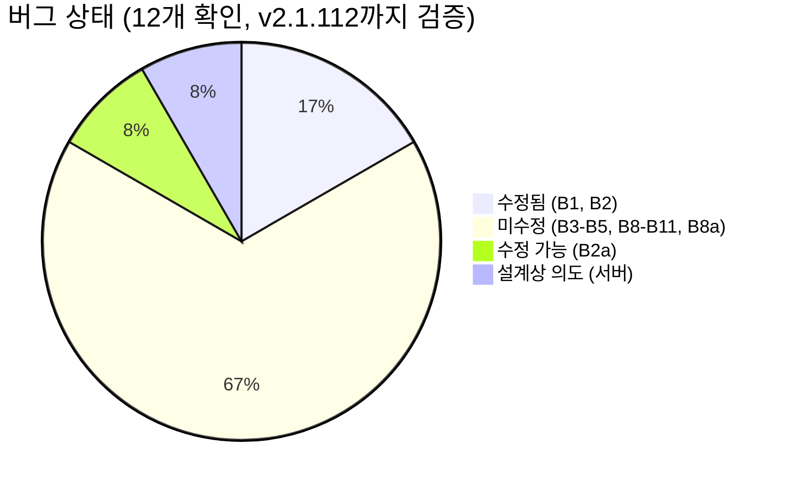

> 이 문서는 [영어 원본](../README.md)의 한국어 번역입니다. | **[Quick fix guide →](../09_QUICKSTART.md)** -- 분석을 건너뛰고 바로 해결

# Claude Code 숨겨진 문제점 분석

> **TL;DR:** Claude Code에는 **11개의 확인된 클라이언트 측 버그**(B1-B5, B8, B8a, B9, B10, B11, B2a)와 **3개의 예비 발견**(P1-P3)이 있습니다. 캐시 버그(B1-B2)는 v2.1.91에서 수정되었습니다. **v2.1.112(최신) 기준 9개가 미수정입니다.** `ubuntu-1-stock` 데이터셋의 프록시 데이터는 이제 22일간(4월 1–22일, 320개 고유 세션) **45,884건의 요청**을 포함합니다. 제어된 GrowthBook flag 오버라이드를 통해 B4/B5 이벤트가 완전히 제거되었습니다 (167,818 → 0, 5,500 → 0). 7일 쿼터 윈도우가 실질적 병목이 될 수 있음이 처음으로 관측되었습니다 -- 7일 사용률이 0.97에 도달했을 때 확인되었습니다. Anthropic은 B11(adaptive thinking zero-reasoning)을 HN에서 인정하였으나 후속 조치는 없습니다.
>
> **최종 업데이트:** 2026년 4월 22일 -- [CROSS-VALIDATION-20260422.md](../CROSS-VALIDATION-20260422.md) (신규: 3자 데이터셋 교차검증), [16_OPUS-47-ADVISORY.md](../16_OPUS-47-ADVISORY.md) (Opus 4.7 권고), [08_UPDATE-LOG.md](../08_UPDATE-LOG.md), [14_DATA-SOURCES.md](14_DATA-SOURCES.md) 참조.

---

## 최신 업데이트 (4월 22일)

### 4월 16일 -- 데이터 소스 재감사, 39K 요청, 3개 라벨링 데이터셋, 환경별 분석

프록시 데이터셋이 **272개 세션**에 걸쳐 **38,996건의 요청**(4월 1–16일)으로 확장되었습니다. 전체 데이터 감사: 3개의 라벨링 데이터셋(JSONL 파일 4,593개 / 메시지 512,149개 / 약 1.9 GB)을 내부 데이터베이스에 인덱싱하였습니다. 신규 챕터: [14_DATA-SOURCES.md](14_DATA-SOURCES.md)(라벨 매트릭스 + 과거 수치와의 조정) 및 [15_ENV-BREAKDOWN.md](15_ENV-BREAKDOWN.md)(환경별 cache_read, 모델 디스패치, 티어 의존적 Haiku 발견). 4월 10일 이후 cache_read: `ubuntu-1-override` **97.08%** vs `ubuntu-1-stock` 96.00% — 오버라이드 하에서 1시간 TTL이 보존되는 것과 일치합니다. Max 5x의 Haiku 비율은 **0.11%** vs Max 20x의 **약 21%** (190배 차이).

### 4월 15일 -- 35K 요청, v2.1.108 검증, @seanGSISG 독립 검증

프록시 데이터셋이 **251개 세션**에 걸쳐 **35,554건의 요청**(4월 1–15일)으로 확장되었습니다. CC v2.1.108까지 검증하였습니다.

**1. 독립 교차 검증.** [@seanGSISG](https://github.com/ArkNill/claude-code-hidden-problem-analysis/issues/3)가 179K건의 호출 데이터셋(2025년 12월–2026년 4월, Max 20x)과 4개의 분석 스크립트를 기여하였습니다. 주요 결과: 사용률 1%당 CacheRead가 1.62–1.72M(우리의 1.5–2.1M 범위 내), JSONL 콘텐츠 블록에서 추정한 thinking 토큰 기여도 0.0–0.1%, 그리고 0배 수식에서는 예산 초과일이 0일이지만 1배 수식에서는 18일이 초과한다는 반사실 증명. 이로써 "before-data 없음"이라는 우리의 한계가 해소되었습니다. [Issue #3 →](https://github.com/ArkNill/claude-code-hidden-problem-analysis/issues/3)

**2. Thinking 토큰 상태 업데이트.** @seanGSISG의 JSONL 분석에 따라 "사각지대"에서 "부분 측정됨"으로 개정되었습니다. 서버 측 계산 비용은 여전히 클라이언트에서 측정할 수 없지만, 콘텐츠 블록 텍스트는 쿼터의 1% 미만임을 시사합니다. [상세 →](../02_RATELIMIT-HEADERS.md#partially-measured-thinking-tokens)

**3. 캐시 효율.** 전체 캐시 효율이 **98.3%**로 향상되었습니다(30K 요청 시점의 97.0%에서). 배리어 이후(플래그 오버라이드 활성): 9,996건의 요청에서 B4/B5 이벤트 0건 지속.

---

### 4월 14일 -- GrowthBook 오버라이드 방법론, 7일 병목 발견, 환경 주의사항

4월 14일의 주요 업데이트:

**1. GrowthBook flag 오버라이드 -- 제어된 제거 테스트.** 4월 10일에 프록시 기반 flag 오버라이드를 배포하였습니다 ([#42542](https://github.com/anthropics/claude-code/issues/42542)에 문서화된 접근법). 결과: 4일간 4,919건의 후속 요청에서 **B5 이벤트 167,818 → 0, B4 이벤트 5,500 → 0**. 동일한 머신, 동일한 계정, 동일한 사용 패턴입니다. 이것은 해당 flag가 context 변조를 직접 제어한다는 가장 강력한 인과 증거입니다. [방법론 →](01_BUGS.md#growthbook-flag-override--controlled-elimination-test-april-1014)

**2. `seven_day` 병목 -- 최초 관측.** 이전에는 `representative-claim` = `five_hour`가 요청의 100%였습니다. 확장된 데이터셋에서 **22.6%의 요청**(5,279/23,374)이 `seven_day`를 실질적 제약으로 나타냈습니다 -- 4월 9-10일에 7일 사용률이 0.85-0.97에 도달했을 때 집중적으로 발생하였습니다. 주간 리셋 이후 `five_hour`가 다시 지배적이 되었습니다. 7일 윈도우는 장식이 아닙니다. [상세 →](../02_RATELIMIT-HEADERS.md#9-seven_day-bottleneck-first-observation-april-914)

**3. 데이터 해석 주의사항.** 4월 10일에 flag 오버라이드를 배포하면서 측정 환경이 변경되었습니다. 모든 B4/B5 이벤트 수(167,818 및 5,500)는 **변경되지 않은 기준선 기간**(4월 1-10일, 25,558건 요청)의 것입니다. 4월 11일 이후 데이터(4,919건 요청)는 오버라이드된 환경을 반영합니다. Rate limit 헤더 분석과 `fallback-percentage` 데이터는 오버라이드의 영향을 받지 않습니다. [주의사항 →](../02_RATELIMIT-HEADERS.md#10-data-interpretation-caveat--environment-changes-april-14)

**4. 업데이트된 지표:** `fallback-percentage`가 23,374건 요청으로 확장되었으며 -- 여전히 매 요청마다 0.5로 분산이 전혀 없습니다. 첫 턴 캐시 미스: 77.8% (158개 세션, 이전 79.0%/143개 세션에서 소폭 개선).

---

### 4월 13일 -- v2.1.101 교차 참조, "Output efficiency" 제거 확인

v2.1.98과 v2.1.101을 확인하였습니다 (v2.1.99/100은 존재하지 않습니다 -- 공개 changelog에서 건너뛰었습니다). 2개 추가 릴리스에서도 B3-B11에 대한 수정은 전혀 없습니다. v2.1.98은 대부분 보안 패치(Bash 권한 우회)였습니다. v2.1.101은 resume 및 MCP 버그를 수정하였습니다 -- B2a(SendMessage 캐시 미스)가 CLI resume 경로를 통해 수정되었을 **수 있으나**, Agent SDK 코드 경로는 미확인입니다. [Changelog 교차 참조 →](01_BUGS.md#changelog-cross-reference-v2192v21101)

"Output efficiency" 시스템 프롬프트 섹션(P3)이 제거된 것으로 보입니다. **353개 로컬 JSONL 세션 파일**을 모두 스캔한 결과 -- 4월 10일 이후의 모든 세션에서 "straight to the point" / "do not overdo" 텍스트가 0건입니다. [@wjordan](https://github.com/wjordan)이 시스템 프롬프트 아카이브 diff를 통해 처음 발견하였습니다. [P3 업데이트 →](01_BUGS.md#p3--output-efficiency-system-prompt-change-v2164-march-3)

또한 143개 세션(요청 3건 이상)에서 첫 턴 캐시 성능을 측정하였습니다: B1/B2가 수정된 v2.1.91+ 에서도 첫 API 호출 시 **79%가 `cache_read=0`**으로 시작합니다. 이것은 구조적 문제입니다 -- skills와 CLAUDE.md가 `system[]` 접두사 대신 `messages[0]`에 배치되어, 새 세션의 prefix 기반 캐싱이 깨집니다. 최신 버전에서 개선 중이지만(커뮤니티 데이터에 따르면 v2.1.104에서 ~29%), 여전히 상당한 첫 턴 비용이 발생합니다. [상세 →](01_BUGS.md#note-residual-first-turn-cache-miss-post-fix-self-measured-april-13)

---

### 4월 9일 -- 5개 신규 버그, 3개 예비 발견, changelog 교차 참조

커뮤니티 전반의 이슈/코멘트 분석 및 팩트체킹(4월 6-9일)을 통해 **5개 신규 버그 + 3개 예비 발견**이 추가되었습니다:

| 버그 | 현상 | 증거 | 상세 |
|------|------|------|------|
| **B8a** | JSONL 비원자적 쓰기 → 세션 손상 | [#21321](https://github.com/anthropics/claude-code/issues/21321)에 10건 이상 중복 | [01_BUGS.md](01_BUGS.md#bug-8a--jsonl-non-atomic-write-corruption-v2185) |
| **B9** | `/branch` context 인플레이션 (6%→73%) | 3건의 중복 이슈 | [01_BUGS.md](01_BUGS.md#bug-9--branch-context-inflation-all-versions) |
| **B10** | TaskOutput 폐기 → 21배 context 주입 → 치명적 오류 | `has repro` | [01_BUGS.md](01_BUGS.md#bug-10--taskoutput-deprecation--autocompact-thrashing-v2192) |
| **B11** | Adaptive thinking zero-reasoning → 허위 생성 | **Anthropic 인정 (HN)** | [01_BUGS.md](01_BUGS.md#bug-11--adaptive-thinking-zero-reasoning-server-side-acknowledged) |
| **B2a** | SendMessage resume: cache_read=0 (system prompt 포함) | cnighswonger 확인 | [01_BUGS.md](01_BUGS.md#bug-2a--sendmessage-resume-cache-miss-agent-sdk) |

**예비 발견 (MODERATE):** P1/P2 캐시 TTL 이중 계층 -- 1h→5m 다운그레이드의 두 가지 트리거: 텔레메트리 비활성화(`has repro`) 및 쿼터 초과. P3 "Output efficiency" 시스템 프롬프트 (v2.1.64). ~~P4 (서드파티 탐지 갭)는 4월 14일에 제거 -- 증거 불충분.~~ [01_BUGS.md -- 예비 발견](01_BUGS.md#preliminary-findings-april-9-moderate--conditional-inclusion) 참조.

**Changelog 교차 참조 (v2.1.92-v2.1.97):** 6개 릴리스에서 9개 미수정 버그에 대한 수정이 전혀 없었습니다. [01_BUGS.md -- Changelog 교차 참조](01_BUGS.md#changelog-cross-reference-v2192v2197) 참조.

### 4월 8일 -- 전체 주간 프록시 데이터셋 -- [13_PROXY-DATA.md](../13_PROXY-DATA.md)

cc-relay 프록시 데이터베이스가 **129개 세션**에 걸쳐 **17,610건의 요청**(4월 1-8일)을 축적하였으며, **532개 JSONL 파일**(158.3 MB)에 대한 자동화된 버그 탐지가 완료되었습니다:

| 지표 | 이전 (4월 3일) | 현재 (4월 1-8일) | 변화 |
|------|---------------|------------------|------|
| Budget enforcement (B5) | 261 이벤트 | **72,839 이벤트** | 279x |
| Microcompact (B4) | 327 이벤트 | **3,782 이벤트** (15,998 항목) | 12x |
| B8 인플레이션 (대량 스캔) | 2.87x (1 세션) | **2.37x 평균** (10 세션, 최대 4.42x) | 전 세션 공통 |
| 합성 rate limit (B3) | 24 항목 / 6일 | **183/532 파일** (34.4%)에서 `<synthetic>` model 항목 | 광범위 |
| Context 증가율 | +575 tok/turn | **중앙값 1,845 tok/min** (53 세션) | 통계적 |

**신규 발견:**
- **요청 빈도:** 78개 세션에서 평균 2.72 req/min. 60분 이상 세션의 지속 최대치 8.04 req/min. 2-3분 초단기 세션은 평균 12+ req/min; 서브에이전트 팬아웃의 버스트 피크 86 req/60s.
- **요청당 비용은 세션 길이에 비례:** 0-30분: $0.20/req → 5시간+: $0.33/req (구조적, 버전 무관)
- **캐시 효율 안정:** v2.1.91에서 모든 세션 길이에 걸쳐 98-99% (버그 1-2 완전 수정)
- **서브에이전트 격차:** Haiku 58.1% 캐시 vs Opus 98.8% -- 40pp 격차 지속
- **Microcompact 심화:** 10 메시지 미만: 1.6 항목/이벤트 → 200+ 메시지: 6.6 항목/이벤트

### Rate limit 헤더 분석 -- [02_RATELIMIT-HEADERS.md](../02_RATELIMIT-HEADERS.md)

투명 프록시(cc-relay)가 **27,708건의 요청**(4월 1-13일)에서 `anthropic-ratelimit-unified-*` 헤더를 캡처하여 서버 측 쿼터 구조를 밝혀냈습니다:

**이중 슬라이딩 윈도우 시스템:**
- 두 개의 독립적인 카운터: **5시간**(`5h-utilization`)과 **7일**(`7d-utilization`)
- `representative-claim` = `five_hour`가 요청의 **100%** -- 5시간 윈도우가 항상 병목입니다
- 5시간 윈도우는 대략 5시간 간격으로 초기화되고, 7일 윈도우는 매주 초기화됩니다 (이 계정의 경우 4월 10일 12:00 KST)

**사용량 1%당 비용** (Max 20x / $200/mo 기준, 5개 활성 윈도우에서 측정):

| 지표 | 범위 | 비고 |
|------|------|------|
| 1%당 출력 | 9K-16K | 사용자에게 보이는 출력만 (thinking 제외) |
| 1%당 Cache Read | 1.5M-2.1M | 전체 보이는 토큰의 96-99%를 차지 |
| 1%당 총 가시적 토큰 | 1.5M-2.1M | Output + Cache Read + Input 합산 |
| 7일 누적 비율 | 0.12-0.17 | 5시간 피크 대비 7일 변화량 |

**Thinking 토큰 사각지대:** Extended thinking 토큰은 API의 `output_tokens` 필드에 **포함되지 않습니다**. 사용량 1%당 보이는 출력이 9K-16K 토큰이므로, 5시간 윈도우 전체(100%)를 사용해도 보이는 출력 토큰은 0.9M-1.6M에 불과합니다 -- Opus로 수 시간 작업한 것치고는 너무 적습니다. 이 차이는 thinking 토큰이 쿼터에 산입되지만, 정확한 메커니즘은 클라이언트 측에서 확인할 수 없다는 것과 일치합니다. Thinking 비활성화 비교 테스트는 4월 6일 주간에 계획되어 있습니다.

**커뮤니티 교차 검증:**
- [@fgrosswig](https://github.com/fgrosswig): [64배 용량 감소](https://github.com/anthropics/claude-code/issues/38335#issuecomment-4189537353) -- 두 대의 머신에서 18일간 JSONL 분석 (3월 26일: 32억 토큰 제한 없음 → 4월 5일: 8,800만에서 90%)
- [@Commandershadow9](https://github.com/Commandershadow9): [34-143배 용량 감소](https://github.com/anthropics/claude-code/issues/41506#issuecomment-4189508296) -- 캐시 수정 확인, 용량 감소는 캐시 버그와 독립적, thinking 토큰 가설

**v2.1.89 분리:** 캐시 문제(3월 28일 - 4월 1일)는 별도의 이슈이며 이미 해결되었습니다. 용량 감소는 독립적으로 존재합니다 -- 캐시가 정상인 기간끼리 비교: 골든 피리어드(3월 23-27일, 캐시 98-99%) vs 수정 후(4월 2일 이후, 캐시 84-97%), 모두 캐시가 건강한 상태. 4월 10일(전체 7일 주기)까지 데이터 수집이 진행 중입니다.

---

## 현재 상태 (2026년 4월 22일 -- v2.1.112까지 검증)

캐시 문제(v2.1.89)는 v2.1.90-91에서 **수정**되었습니다. **8개의 클라이언트 측 버그가 v2.1.112(최신)까지 미수정입니다.** B2a(SendMessage resume)는 v2.1.101에서 **수정 가능**(CLI resume 경로 수정, SDK 경로 미확인). P3("Output efficiency" 프롬프트)는 **제거 확인**(자체 검증). Changelog 교차 참조: [01_BUGS.md -- Changelog 교차 참조](01_BUGS.md#changelog-cross-reference-v2192v21101).

| 버그 | 현상 | 영향 | 상태 | 상세 |
|------|------|------|------|------|
| **B1** Sentinel | standalone 바이너리가 캐시 prefix 손상 | 캐시 활용률 4-17% (v2.1.89) | **수정됨** | [01_BUGS.md](01_BUGS.md#bug-1--sentinel-replacement-standalone-binary-only) |
| **B2** Resume | `--resume`이 전체 context를 캐시 없이 재전송 | resume마다 전체 캐시 미스 | **수정됨** | [01_BUGS.md](01_BUGS.md#bug-2--resume-cache-breakage-v2169) |
| **B2a** SendMessage | Agent SDK SendMessage resume: system prompt 포함 전체 캐시 미스 | 첫 resume에서 cache_read=0 | **수정 가능** | [01_BUGS.md](01_BUGS.md#bug-2a--sendmessage-resume-cache-miss-agent-sdk) |
| **B3** False RL | 클라이언트가 가짜 오류로 API 호출 차단 | 즉시 "Rate limit reached" | **미수정** | [01_BUGS.md](01_BUGS.md#bug-3--client-side-false-rate-limiter-all-versions) |
| **B4** Microcompact | 세션 중간에 도구 결과가 조용히 삭제됨 | 5,500 이벤트, 18,858 항목 삭제 | **미수정** | [01_BUGS.md](01_BUGS.md#bug-4--silent-microcompact--context-quality-degradation-all-versions-server-controlled) |
| **B5** Budget cap | 도구 결과에 200K 총량 제한 적용 | 167,818 이벤트, 100% 잘림 | **미수정** | [01_BUGS.md](01_BUGS.md#bug-5--tool-result-budget-enforcement-all-versions) |
| **B8** Log inflation | Extended thinking이 JSONL에 중복 항목 생성 | 2.37x 평균 (최대 4.42x), 전 세션 공통 | **미수정** | [01_BUGS.md](01_BUGS.md#bug-8--jsonl-log-duplication-all-versions) |
| **B8a** JSONL corruption | 동시 도구 실행이 tool_result 누락 → 영구 400 오류 | [#21321](https://github.com/anthropics/claude-code/issues/21321)에 10건 이상 중복 | **미수정** | [01_BUGS.md](01_BUGS.md#bug-8a--jsonl-non-atomic-write-corruption-v2185) |
| **B9** /branch inflation | branch에서 메시지 중복/압축 해제 | 한 메시지에서 6%→73% context | **미수정** | [01_BUGS.md](01_BUGS.md#bug-9--branch-context-inflation-all-versions) |
| **B10** TaskOutput thrash | 폐기 메시지가 21배 context 주입 유발 → 치명적 오류 | 87K vs 4K, 3회 연속 autocompact | **미수정** | [01_BUGS.md](01_BUGS.md#bug-10--taskoutput-deprecation--autocompact-thrashing-v2192) |
| **B11** Zero reasoning | Adaptive thinking이 추론 0으로 → 허위 생성 | **Anthropic 인정** | 조사 중 | [01_BUGS.md](01_BUGS.md#bug-11--adaptive-thinking-zero-reasoning-server-side-acknowledged) |
| **서버** | 쿼터 구조 + thinking 토큰 과금 | 실효 용량 감소 | **설계상 의도** | [02_RATELIMIT-HEADERS.md](../02_RATELIMIT-HEADERS.md) |

### 할 수 있는 조치

1. **v2.1.91+로 업데이트하십시오** -- 캐시 문제가 수정됩니다 (사용량 소진의 가장 큰 원인). v2.1.92-101은 이 문서에서 추적하는 버그에 대한 수정은 없지만 사용해도 안전합니다
2. **npm이든 standalone이든 v2.1.91에서는 모두 정상입니다** (Sentinel 버그 해소)
3. **`--resume`이나 `--continue`는 사용하지 마십시오** -- 이전 대화 전체가 유료 입력으로 재전송됩니다
4. **주기적으로 새 세션을 시작하십시오** -- 200K 도구 결과 상한(B5)이 오래된 결과를 알림 없이 잘라냅니다
5. **`/dream`과 `/insights`는 자제하십시오** -- 사용자 모르게 백그라운드에서 API를 호출하여 사용량이 소진됩니다

설정 가이드와 자가 진단은 [09_QUICKSTART.md](../09_QUICKSTART.md)를 참조하십시오. 전체 프록시 데이터셋: **[13_PROXY-DATA.md](../13_PROXY-DATA.md)**.

---

## 서버 측 요인 (미해결)

캐시가 95-99%로 정상 작동해도 사용량 소진은 계속됩니다. 최소 4가지 서버 측 이슈가 여기에 기여하고 있습니다:

**1. 서버 측 과금 변경:** 오래된 Docker 버전(v2.1.74, v2.1.86 -- 한 번도 업데이트하지 않은 것)이 최근 갑자기 빠르게 소진되기 시작하였습니다. 프로그램을 업데이트하지 않았는데도 소진이 빨라졌다는 것은, 이 문제가 순수하게 클라이언트 측만의 문제가 아니라는 증거입니다 ([#37394](https://github.com/anthropics/claude-code/issues/37394)).

**2. 1M context 과금 오류:** 3월 말에 발생한 문제로, 서버가 Max 플랜의 1M context 요청을 "추가 사용량"으로 잘못 분류합니다. 디버그 로그에서 겨우 ~23K 토큰에서 429 오류가 발생합니다 ([#42616](https://github.com/anthropics/claude-code/issues/42616)).

**3. 이중 윈도우 쿼터 + thinking 토큰 사각지대:** 5시간 + 7일 독립 윈도우. 사용자에게 보이는 출력은 1%당 9K-16K에 불과합니다 -- 이 차이는 thinking 토큰이 쿼터에 산입되지만 클라이언트에게는 보이지 않기 때문일 가능성이 높습니다. 전체 분석: [02_RATELIMIT-HEADERS.md](../02_RATELIMIT-HEADERS.md).

**4. 조직 수준 쿼터 공유:** 같은 조직에 소속된 계정들이 rate limit 풀을 공유합니다. `passesEligibilityCache`와 `overageCreditGrantCache`가 `accountUuid`가 아닌 `organizationUuid` 기준으로 관리됩니다. [@dancinlife](https://github.com/dancinlife)가 난독화된 JavaScript 번들의 클라이언트 측 분석을 통해 처음 발견하였습니다.

---

## 사용 시 주의사항

**[09_QUICKSTART.md](../09_QUICKSTART.md)**에서 피해야 할 행동과 권장 행동의 전체 목록을 참조하십시오. `/branch`, `/release-notes` 및 환경 변수 권장사항이 포함되어 있습니다.

---

## 배경

### 시작 경위

2026년 4월 1일, 평소와 같은 코딩 작업 중이었는데 Max 20 플랜($200/mo)이 약 70분 만에 사용량 100%에 도달하였습니다. JSONL 분석 결과, 해당 세션의 평균 캐시 활용률이 **36.1%**(최솟값 21.1%)로 나타났습니다. 정상이라면 90% 이상이어야 하는 수치입니다. 모든 토큰이 정가로 과금되고 있었습니다.

v2.1.89에서 v2.1.68로 다운그레이드하자 캐시가 즉시 **97.6%**로 회복되었습니다 -- 문제가 특정 버전에서 발생한 것임을 확인하였습니다. 이후 요청별 데이터를 기록하기 위해 투명 모니터링 프록시(cc-relay)를 구축하였습니다.

개인적인 디버깅으로 시작한 작업이 빠르게 확장되었습니다. 수십 명의 사용자가 [91건 이상의 GitHub 이슈](../10_ISSUES.md)에서 동일한 증상을 보고하고 있었습니다. 커뮤니티 멤버들 -- [@Sn3th](https://github.com/Sn3th), [@rwp65](https://github.com/rwp65), [@fgrosswig](https://github.com/fgrosswig), [@Commandershadow9](https://github.com/Commandershadow9), 그리고 [12명의 기여자들](../10_ISSUES.md#contributors--acknowledgments) -- 이 독립적으로 퍼즐의 각기 다른 조각을 발견하였습니다.

**조사 타임라인:**

| 날짜 | 발견 내용 |
|------|----------|
| 4월 1일 | 70분 만에 100% 소진 → v2.1.89 문제 확인, 프록시 구축 |
| 4월 2일 | 버그 3-4 발견 (가짜 rate limiter, 조용한 microcompact). Anthropic의 Lydia Hallie가 X에 게시 |
| 4월 3일 | 버그 5 발견 (200K budget cap). v2.1.91 벤치마크: 캐시 수정 확인, 4개 다른 버그 지속 (B3-B5, B8). [06_TEST-RESULTS-0403.md](../06_TEST-RESULTS-0403.md) |
| 4월 4-6일 | cc-relay가 rate limit 헤더와 함께 3,702건 요청 캡처. 커뮤니티 분석 계속 |
| 4월 6일 | 이중 윈도우 쿼터 분석 발표. 커뮤니티 교차 검증 (fgrosswig 64배, Commandershadow9 34-143배). [02_RATELIMIT-HEADERS.md](../02_RATELIMIT-HEADERS.md) |

전체 14개월 연대기 (2025년 2월 -- 2026년 4월): [07_TIMELINE.md](../07_TIMELINE.md)

### Anthropic의 입장 (4월 2일)

Lydia Hallie (Anthropic, Product)가 [X에 게시](https://x.com/lydiahallie/status/2039800715607187906)하였습니다:

> *"피크 시간대 제한이 더 엄격해졌고 1M context 세션이 커졌습니다. 여러분이 느끼는 대부분이 이것입니다. 과정에서 몇 가지 버그를 수정했지만, 과다 청구된 것은 없습니다."*

Lydia Hallie는 Sonnet을 기본 모델로 사용하고, effort 레벨을 낮추고, 이어쓰기 대신 새로 시작하고, `CLAUDE_CODE_AUTO_COMPACT_WINDOW=200000`으로 context를 제한할 것을 [권장](https://x.com/lydiahallie/status/2039800718371307603)하였습니다.

**이 분석의 데이터가 위 입장과 다른 지점들:**

- **"과다 청구된 것은 없습니다"** -- 버그 5는 도구 결과가 총 200K를 넘으면 1-49자로 조용히 잘라냅니다. 1M context에 비용을 지불하는 사용자들이 실제로는 내장 도구에 200K 도구 결과 한도만 사용할 수 있습니다. 단일 세션에서 261건의 잘림 이벤트가 측정되었습니다.
- **"몇 가지 버그를 수정했습니다"** -- 캐시 버그(B1-B2)는 수정되었지만, 버그 3-5와 B8은 v2.1.91에서 여전히 활성 상태입니다. 클라이언트 측 가짜 rate limiter(B3)는 이 분석 환경에서 65개 세션에 걸쳐 151개의 가짜 "Rate limit reached" 오류를 생성하였습니다 -- API 호출은 단 한 건도 없었습니다.
- **"피크 시간대 제한이 더 엄격해졌습니다"** -- 4월 6일 프록시 데이터에 따르면 병목은 항상 5시간 윈도우입니다 (`representative-claim` = `five_hour`가 3,702건 요청의 100%). 시간대와 무관합니다. 주말과 비첨두 시간대 데이터도 같은 패턴을 보입니다.
- **Thinking 토큰 과금** -- Extended thinking 토큰은 API의 `output_tokens`에 표시되지 않지만, 사용자에게 보이는 출력만으로는 관측된 사용량 비용의 절반도 설명하지 못합니다. thinking 토큰이 출력 토큰 비율로 쿼터에 산입된다면, 사용자가 모니터링하거나 통제할 수 없는 상당한 숨겨진 비용이 존재하는 것입니다.

**GitHub 응답:** bcherny가 [#42796](https://github.com/anthropics/claude-code/issues/42796)에 6개의 코멘트를 게시하였습니다 (4월 6일에만, HN 바이럴에 의해 촉발). 이후 침묵. #38335(478개 코멘트, 15일) 포함 90건 이상의 다른 이슈에는 응답이 전혀 없습니다. 전체 응답 이력은 [10_ISSUES.md](../10_ISSUES.md#anthropic-official-response)를 참조하십시오.

### 캐시 TTL (버그 아님)

[@luongnv89](https://github.com/luongnv89)가 13시간 이상 사용하지 않으면 캐시가 완전히 재구축된다고 [분석](https://github.com/luongnv89/cc-context-stats/blob/main/context-stats-cache-misses.md)하였습니다. Anthropic은 5분 TTL을 문서화하고 있지만, 이 분석의 데이터에서는 5-26분 간격에서도 96% 이상 캐시가 유지되는 경우가 있었습니다 -- 실제 TTL은 공식 수치보다 길 수 있습니다. 버그는 아니지만 알아두면 유용합니다.

---

## 문서 목록

| 파일 | 내용 | 업데이트 |
|------|------|----------|
| **[01_BUGS.md](01_BUGS.md)** | 전체 11개 버그 (B1-B11, B2a, B8a) + 3개 예비 발견 (P1-P3, P4 제거) + changelog 교차 참조 (v2.1.92-108) | 4월 15일 |
| **[09_QUICKSTART.md](../09_QUICKSTART.md)** | Quick fix 가이드 -- Option A (v2.1.91+) vs Option B (v2.1.63 다운그레이드), npm vs standalone, 진단 | 4월 9일 |
| **[07_TIMELINE.md](../07_TIMELINE.md)** | 14개월 연대기 (Phase 1-9) + 4월 6-9일 커뮤니티 가속 + Anthropic 응답 | 4월 9일 |
| **[08_UPDATE-LOG.md](../08_UPDATE-LOG.md)** | 일일 조사 로그 + changelog 교차 참조 | 4월 16일 |
| **[10_ISSUES.md](../10_ISSUES.md)** | 91건 이상 추적 이슈 + 커뮤니티 도구 + 기여자 | 4월 9일 |
| **[13_PROXY-DATA.md](../13_PROXY-DATA.md)** | 전체 프록시 데이터셋 (38,996건 요청, 272개 세션, 4월 1–16일) + Mermaid 시각화 | 4월 16일 |
| **[14_DATA-SOURCES.md](14_DATA-SOURCES.md)** | 데이터 라벨 매트릭스(`ubuntu-1-stock` / `ubuntu-1-override` / `win-1-stock`), 이전의 "단일 머신" 수치와의 조정, 내부 데이터베이스 스키마 개요 | 4월 16일 |
| **[15_ENV-BREAKDOWN.md](15_ENV-BREAKDOWN.md)** | 환경별 cache_read 비율(4월 10일 기준 전/후, 일별 추이), Max 20x 대 Max 5x 모델 디스패치 비교, 티어 의존적 Haiku 비율 발견 | 4월 16일 |
| **[02_RATELIMIT-HEADERS.md](../02_RATELIMIT-HEADERS.md)** | 이중 5h/7d 윈도우 구조, 1%당 비용, thinking 토큰 사각지대, fallback-percentage 확장 데이터 | 4월 15일 |
| **[03_JSONL-ANALYSIS.md](../03_JSONL-ANALYSIS.md)** | 세션 로그 분석: PRELIM 인플레이션, 서브에이전트 비용, 수명주기 곡선, 프록시 교차 검증 | 4월 6일 |
| **[05_MICROCOMPACT.md](../05_MICROCOMPACT.md)** | 심층 분석: 조용한 context 삭제 (버그 4) + 도구 결과 예산 (버그 5) | 4월 3일 |
| **[04_BENCHMARK.md](../04_BENCHMARK.md)** | npm vs standalone 벤치마크 + 요청별 원시 데이터 | 4월 3일 |
| **[06_TEST-RESULTS-0403.md](../06_TEST-RESULTS-0403.md)** | 4월 3일 통합 테스트 결과 -- 전체 버그 검증 | 4월 3일 |
| **[11_USAGE-GUIDE.md](../11_USAGE-GUIDE.md)** | 필수 사용 가이드 -- 세션, context, CLAUDE.md, 토큰 절약 | 4월 8일 |
| **[12_ADVANCED-GUIDE.md](../12_ADVANCED-GUIDE.md)** | 고급 사용 가이드 -- hooks, 서브에이전트, 모니터링, rate limit 전략 | 4월 8일 |

## 환경

- **주요 데이터셋(이 저장소가 발표한 분석): `ubuntu-1-stock`**
  - **플랜:** Max 20 ($200/mo)
  - **OS:** Linux (Ubuntu), Linux workstation (ubuntu-1)
  - **CC 모드:** 네이티브 `~/.claude` (CC stock, 플래그 오버라이드나 기타 계측 없음)
  - **테스트 버전:** v2.1.91 (벤치마크), v2.1.90, v2.1.89, v2.1.68. Changelog는 **v2.1.108**까지 검증
  - **모니터링:** cc-relay v2 투명 프록시 — **272개 세션에 걸쳐 총 38,996건 요청 (4월 1–16일)**
- **병렬 데이터셋(별도로 추적, [14_DATA-SOURCES.md](14_DATA-SOURCES.md) 참조):** `ubuntu-1-override`(동일 머신/계정, 4월 10일부터 GrowthBook 플래그 오버라이드가 활성화된 분리 오버라이드 환경 — 추가 구성요소는 비공개로 유지), `win-1-stock`(Windows 11, Max 5x — 연구/검증 전용, 주요 공개 분석에는 사용되지 않음)
- **날짜:** 2026년 4월 16일

---

## 기여자

이 분석은 많은 커뮤니티 멤버들이 독립적으로 조사하고 측정한 결과를 기반으로 합니다. 전체 내용은 [10_ISSUES.md](../10_ISSUES.md#contributors--acknowledgments)를 참조하십시오.

| 기여자 | 주요 기여 |
|--------|----------|
| [@Sn3th](https://github.com/Sn3th) | microcompact 메커니즘(버그 4), GrowthBook flag, budget 파이프라인(버그 5) 발견 |
| [@rwp65](https://github.com/rwp65) | 클라이언트 측 가짜 rate limiter(버그 3) 발견 |
| [@cnighswonger](https://github.com/cnighswonger) | [cache-fix interceptor](https://github.com/cnighswonger/claude-code-cache-fix) 개발 -- 4,700건 호출, 98.3% 캐시 히트, TTL 계층 탐지 |
| [@wpank](https://github.com/wpank) | 47,810건 요청 추적, v2.1.63 vs v2.1.96 정량 비교 |
| [@fgrosswig](https://github.com/fgrosswig) | 64배 용량 감소 분석 -- 18일간 JSONL 분석 |
| [@Commandershadow9](https://github.com/Commandershadow9) | 34-143배 용량 감소 분석, thinking 토큰 가설 |
| [@kolkov](https://github.com/kolkov) | [ccdiag](https://github.com/kolkov/ccdiag) 개발, v2.1.91 resume 문제 식별 |
| [@simpolism](https://github.com/simpolism) | Resume 캐시 수정 패치 (99.7-99.9% 히트) |
| [@bilby91](https://github.com/bilby91) | resume 시 skill_listing + companion_intro 캐시 미스 식별 |
| [@labzink](https://github.com/labzink) | SendMessage 캐시 전체 미스(버그 2a) 식별 |
| [@wjordan](https://github.com/wjordan) | [Piebald-AI](https://github.com/Piebald-AI/claude-code-system-prompts)를 통해 "Output efficiency" 시스템 프롬프트 변경 발견 |
| [@EmpireJones](https://github.com/EmpireJones) | 텔레메트리-캐시 TTL 연계 발견 (Anthropic `has repro`) |
| [@dancinlife](https://github.com/dancinlife) | organizationUuid 쿼터 풀링 발견 |
| [@luongnv89](https://github.com/luongnv89) | 캐시 TTL 분석, [CUStats](https://custats.info) 개발 |
| [@weilhalt](https://github.com/weilhalt) | rate limit 모니터링용 [BudMon](https://github.com/weilhalt/budmon) 개발 |
| [@arizonawayfarer](https://github.com/arizonawayfarer) | GrowthBook flag 덤프, acompact 도구 중복 분석 (35%) |
| [@progerzua](https://github.com/progerzua) | `/branch` context 인플레이션 측정 (버그 9) |
| Reddit 커뮤니티 | 캐시 sentinel 메커니즘의 [리버스 엔지니어링](https://www.reddit.com/r/ClaudeAI/s/AY2GHQa5Z6) |

*이 분석은 커뮤니티 리서치와 개인 측정을 기반으로 합니다. Anthropic이 보증한 것이 아닙니다. 모든 우회 방법은 공식 도구와 문서화된 기능만 사용합니다.*
